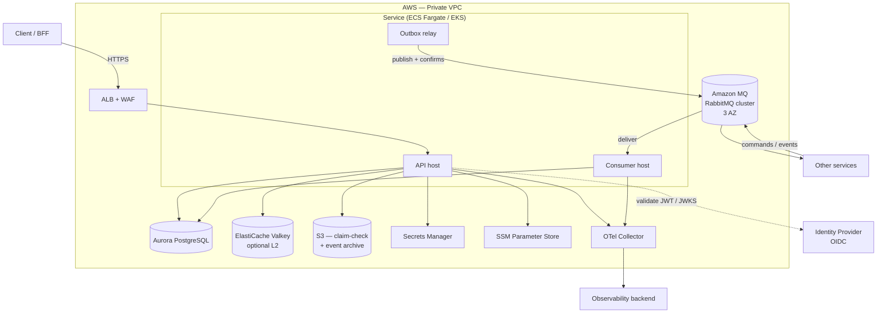
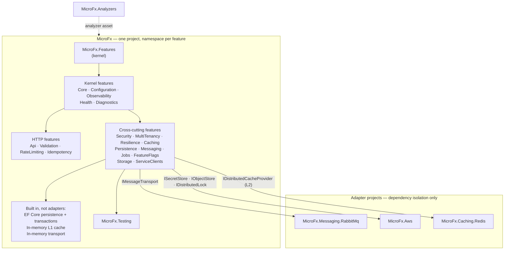
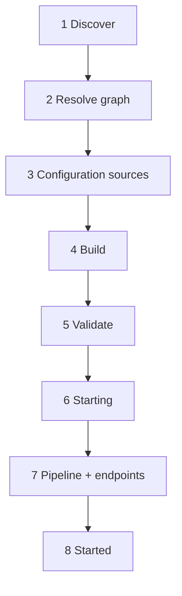
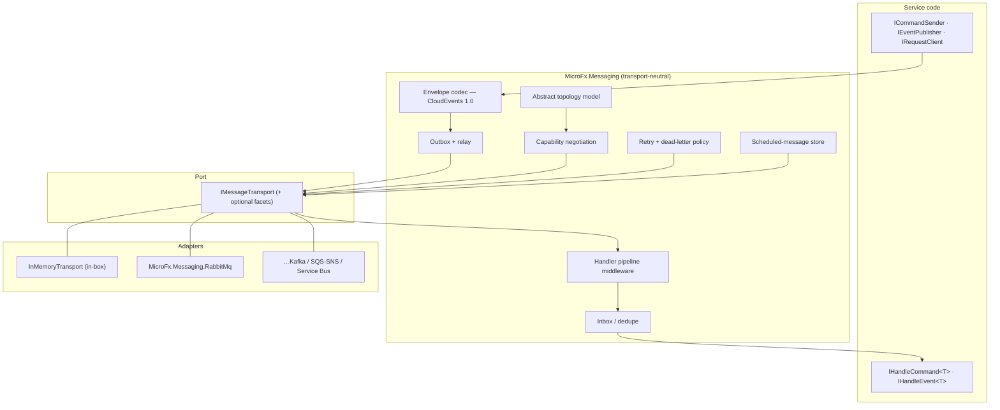
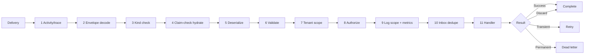
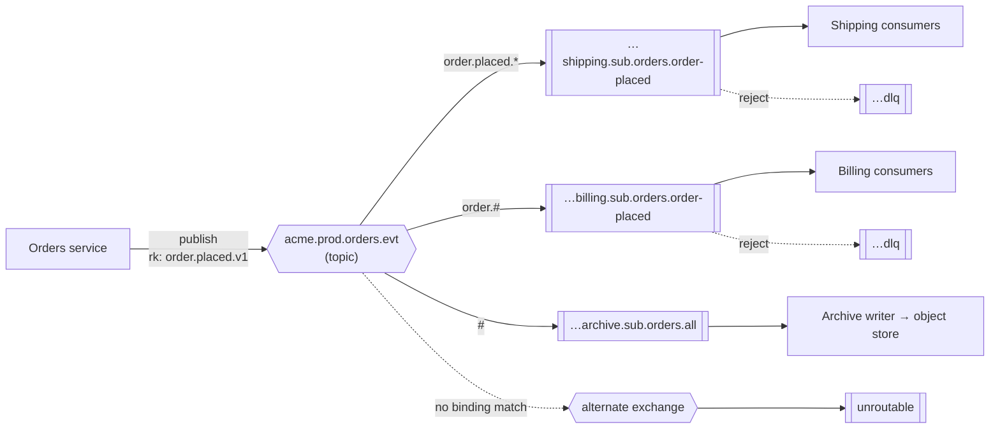
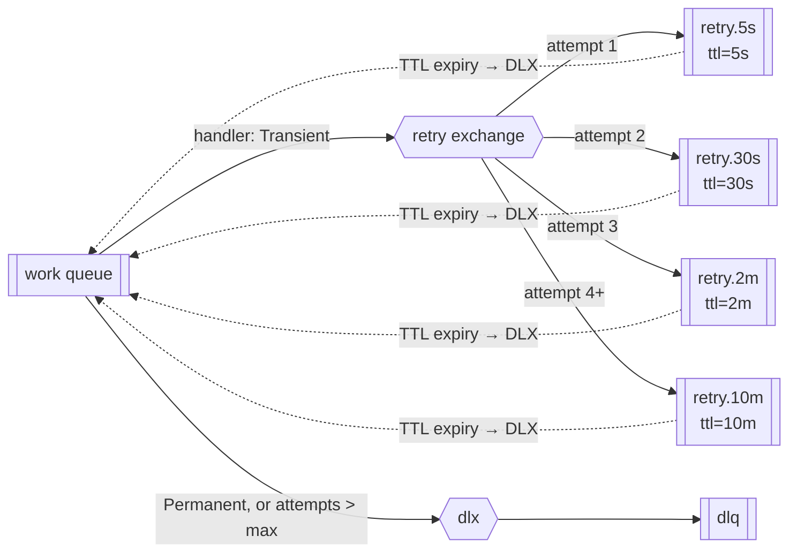
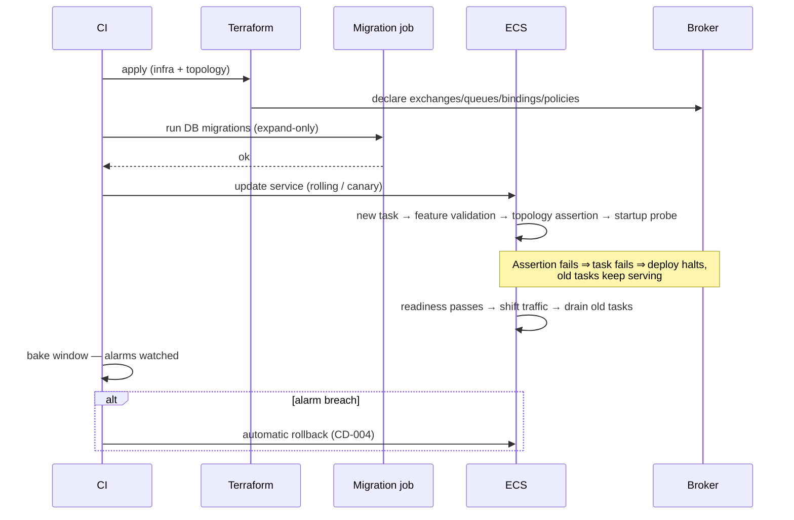

# MicroFx — Technical Design

**Document ID:** MFX-TD-001
**Version:** 1.0
**Date:** 2026-08-16
**Companion to:** PLT-SPEC-001 — Requirement Specification · MFX-PLAN-001 — Implementation Plan
**Stack:** .NET 10 (LTS) / C# 14 · cloud-neutral core · RabbitMQ and AWS as reference adapters

> Supersedes and consolidates PLT-TD-001 (technical design) and MFX-TD-002 (feature platform design).
> Requirement ids (`FEA-012`, `TRN-005`, `MSG-018`, …) reference PLT-SPEC-001 throughout.

---

## 1. Introduction

### 1.1 Purpose

MicroFx is a **microservice platform**: a set of cross-cutting capabilities that hook into a service's `Program`/startup and make it production-grade without the service writing platform code. This document specifies how it is built — the composition mechanism, the built-in capabilities, the extension contract, the messaging design, and the runtime behaviour of each.

### 1.2 Design tenets

| Tenet | Consequence in this design |
|---|---|
| **Everything is a feature** | Every capability, built-in or custom, is composed through one identified, ordered, introspectable contract (§4). The platform has no privileged registration path a service author cannot use. |
| **The platform owns the pipeline; services own the handlers** | Cross-cutting behaviour is middleware a service cannot forget to add, in an order it cannot get wrong. |
| **Replaceable at every grain** | Disable, configure, replace wholesale, or override one service (§6). There is no cliff at which a service falls off the golden path permanently. |
| **Opt-out is explicit and greppable** | Disabling a default requires a named call or a config key, both of which show up in review, in CI policy scans, and at `/internal/features`. |
| **Ports at cloud and broker boundaries; SDKs elsewhere** | The core references no cloud SDK. Where wrapping an SDK buys neither testability nor policy enforcement, the client is exposed directly. |
| **Emulate conveniences, never fake guarantees** | A missing native delay is emulated and reported; a missing delivery guarantee fails startup (§8.4). |
| **Handler code is transport-agnostic** | A handler receives a typed message and a context; it never sees a channel, a delivery tag, or a routing key. |
| **Failure modes are explicit types, not exceptions-by-convention** | `Transient` vs. `Permanent` drives retry vs. dead-letter, decided by type rather than by string-matching an exception message. |
| **Topology is infrastructure, not runtime behaviour** | The app *asserts* topology; it never creates it. Provisioning is an IaC and migration concern. |

### 1.3 Key decisions

| Concern | Decision | Rationale | Rejected |
|---|---|---|---|
| Runtime | .NET 10 LTS | Support horizon; `HybridCache`, `TimeProvider`, keyed DI, native OTel maturity | .NET 8 (shorter horizon) |
| Composition | **Feature model** — `IMicroFxFeature` + kernel | Ordering, lifecycle, identity, and replaceability that `Add*`/`Use*` cannot express | A single `AddDefaults()` call (no ordering guarantees, no override grain) |
| Packaging | **One project**, namespace per feature | Separation by namespace, not assembly: one version surface, one CI surface | Package-per-concern (15 versions, and a packaging decision per concern for every consumer) |
| Cloud coupling | **Cloud-neutral core**, `MicroFx.Aws` adapter | Core builds and tests offline; ports enable test doubles | Cloud SDK in core (untestable offline) |
| Messaging | **`IMessageTransport` port with capability negotiation** | Envelope, outbox, inbox, and pipeline written once; a broker becomes a mapping exercise | Broker inside the abstraction (makes the transport decision irreversible) |
| Default transport | RabbitMQ 3.13+ on Amazon MQ via `MicroFx.Messaging.RabbitMq` | Managed; validates the port against a demanding broker | — (alternatives are adapters, not rejections) |
| Dev/test transport | **In-memory** (`System.Threading.Channels`), in-box | Full messaging semantics in CI with no container | Testcontainers-only (slow, and hides port leaks) |
| AMQP client | `RabbitMQ.Client` v7 (fully async) | First-party, async-native, no licence risk | — |
| Persistence | **EF Core built in**, `Relational` only, no driver | The outbox is defined by atomicity; a stubbed store demonstrates nothing | Persistence behind a port with an in-memory stub |
| Zero-config store | **SQLite in-memory** | Relational and transactional, so tests exercise the real path | EF `InMemory` provider (no transactions — tests would pass for the wrong reason) |
| Caching | **In-memory L1 built in**; distributed L2 opt-in | L1 alone is already a correct cache; a port would ship a worse default for nothing | Requiring Redis for basic caching |
| Serialization | `System.Text.Json`, source-generated contexts | AOT-compatible, no reflection startup cost | Newtonsoft (perf, AOT) |
| Resilience | Polly v8 via `Microsoft.Extensions.Http.Resilience` | First-party integration, telemetry included | Hand-rolled retry |
| IaC | Terraform + shared modules | Mandated | CDK, Pulumi |
| Compute | ECS Fargate (default) / EKS | Both behind one deployment abstraction | — |

---

## 2. System Context



### 2.1 Process model

A service deploys as **one container image** whose role is selected by configuration, so API, consumers, and the outbox relay scale independently while sharing one build artefact.

| Role | Env var | Hosted services | Scaling signal |
|---|---|---|---|
| `api` | `MICROFX__ROLE=api` | Kestrel, outbox relay (optional) | RPS / CPU |
| `consumer` | `MICROFX__ROLE=consumer` | Consumer host, management port only | Queue depth (KEDA / target tracking) |
| `relay` | `MICROFX__ROLE=relay` | Outbox relay, leader-elected | Fixed 2 replicas (1 active) |
| `all` | `MICROFX__ROLE=all` | Everything — **dev/local only** | — |

> **Why split.** Consumer backlog and HTTP traffic have unrelated scaling curves. Running them in one process means a queue spike scales out Kestrel replicas that do nothing, and consumer prefetch memory competes with request handling.

---

## 3. Solution Structure

### 3.1 Platform repository layout

**One project holds all MicroFx functionality**, separated by namespace. Extra assemblies exist only where a technical constraint forces one (the Roslyn analyzer) or where the boundary is the point (adapters isolating a third-party dependency).

```
src/
  MicroFx/                              # THE core project
    Features/         Hosting/          Core/
    Configuration/    Observability/    Health/          Diagnostics/
    Api/              Validation/       RateLimiting/    Idempotency/
    Security/         MultiTenancy/     Resilience/      Caching/
    Persistence/      Jobs/             FeatureFlags/    Storage/    ServiceClients/
    Messaging/                          #   envelope, pipeline, outbox, inbox, topology
      Transport/                        #   port, capabilities, negotiation
      Transport/InMemory/               #   in-box transport
    Testing/                            #   harness — no third-party dependency
  MicroFx.Messaging.RabbitMq/           # adapter — isolates RabbitMQ.Client
  MicroFx.Analyzers/                    # netstandard2.0, compiler-loaded
  MicroFx.Host.Service/                 # reference host — a real service with MicroFx enabled (§3.3)
test/
  MicroFx.Tests/                        # NUnit 4
  MicroFx.Messaging.RabbitMq.Tests/     # adapter + conformance (Testcontainers)
  MicroFx.Host.Service.E2E.Tests/       # end-to-end, two lanes (§16.1)
deploy/
  docker-compose.yml
```

**Why one project rather than the obvious fifteen.** An assembly boundary buys independent versioning, independent deployment, and compiler-enforced encapsulation. The first two are liabilities here — nobody wants to reason about `MicroFx.Caching 2.1` against `MicroFx.Api 3.0`, and it all deploys together anyway. Only the third is real, and it is recovered cheaply: implementation types are `internal sealed`, `InternalsVisibleTo` goes to `MicroFx.Tests` alone, and an architecture test asserts no feature namespace reaches into another's internals — only ports and the kernel. A build error becomes a test failure, which is a fair trade for removing fourteen packaging decisions from every consuming service.

The two projects that are not `MicroFx`:

| Project | Why it cannot be a namespace |
|---|---|
| `MicroFx.Analyzers` | Hard constraint: an analyzer must target `netstandard2.0`, loads into the compiler process, and ships under `analyzers/dotnet/cs/`. It cannot be the same assembly as a `net10.0` runtime library. `MicroFx` references it as an analyzer asset, so one package reference still delivers the rules. |
| `MicroFx.Messaging.RabbitMq` | Dependency isolation. Folding it in would put `RabbitMQ.Client` on the graph of every service including those with no messaging, defeating the point of the transport port. |

Future adapters (`MicroFx.Aws`, `MicroFx.Caching.Redis`) follow the same rule: separate **only** to isolate a third-party dependency, never to split MicroFx's own functionality.

### 3.2 Package graph



Inter-feature dependencies replace inter-package dependencies. The outbox and inbox are persistence concerns (EVT-004, MSG-004), expressed as a graph edge rather than an assembly reference:

```csharp
// MessagingFeature
DependsOn = [BuiltIn.Core, BuiltIn.Persistence],   // only when outbox/inbox are enabled
After     = [BuiltIn.Security, BuiltIn.MultiTenancy],
```

A stateless consumer calls `m.WithoutOutbox()`, the persistence edge drops from the graph, and nothing else changes — no second package, no packaging decision.

### 3.3 `MicroFx.Host.Service` — the reference host

A **real, runnable, deployable service with MicroFx enabled**, in `src` rather than a `samples` folder — because a sample rots, while a project that CI builds, containerises, and end-to-end tests cannot.

| Purpose | How |
|---|---|
| **Proof the platform composes** | It is the vehicle for the specification's acceptance criteria. AC-01…AC-50 are asserted against this service, not a hypothetical one. |
| **Executable documentation** | `Program.cs` is the quickstart. If the README disagrees with it, the file is right, because it compiles. |
| **Dogfooding pressure** | Every awkwardness in the feature contract shows up here first. A platform whose own reference service needs an escape hatch has a design problem worth knowing about early. |
| **The e2e target** | The container it produces is what §16.1's outer lane exercises. |

```csharp
// src/MicroFx.Host.Service/Program.cs — the whole composition
var builder = WebApplication.CreateBuilder(args);

builder.AddMicroFx(fx =>
{
    fx.Configure<PersistenceFeature>(p => p
        .UseDbContext<OrdersDbContext>(o => o.UseNpgsql(builder.Configuration.GetConnectionString("Orders")))
        .UseOutbox().UseInbox());

    fx.Configure<MessagingFeature>(m =>
    {
        m.PublishesEvent<OrderPlacedV1>();
        m.HandlesCommand<ReserveInventory, ReserveInventoryHandler>();
        m.SubscribesToEvent<OrderPlacedV1, OrderPlacedProjectionHandler>(
            s => s.WithConcurrency(4).WithPrefetch(16));
    });

    fx.AddFeature<ExampleCustomFeature>();     // proves the extension contract from outside the kernel
});

builder.Services.AddOrdersDomain();

var app = builder.Build();
await app.RunMicroFxAsync();
```

It exercises deliberately one of everything rather than a kitchen sink: a versioned API with validation and Problem Details; an `Order` aggregate with a migration and an ambient transaction spanning state change and outbox; a published event, a handled command, and a subscription to its own event; a cached read endpoint; a scheduled job with leader election; readiness reflecting database and transport; a custom feature with declared edges, a middleware stage, a lifecycle hook, and a validator.

**Transport and store are configuration, not code.** The same binary runs on the in-memory transport + SQLite (default, no infrastructure) or RabbitMQ + PostgreSQL (compose and CI). `MICROFX__ROLE` selects `api`/`consumer`/`relay`/`all` from the one image (§2.1). That equivalence is itself an assertion — it is how AC-39 is demonstrated.

### 3.4 Generated service layout

```
src/
  Acme.Orders.Api/                 # Host — Program.cs, endpoints, consumer registrations
  Acme.Orders.Application/         # Use cases, ports, validators, DTOs
  Acme.Orders.Domain/              # Entities, VOs, domain events, invariants
  Acme.Orders.Infrastructure/      # EF Core, repositories, adapters
  Acme.Orders.Contracts/           # PUBLISHED PACKAGE: integration events + commands
tests/
  …UnitTests/ …ArchitectureTests/ …IntegrationTests/ …ContractTests/
deploy/
  terraform/  topology/  ecs/ | helm/
docs/  adr/  runbook.md  c4/
```

Hexagonal, with the dependency rule enforced by architecture tests (QUA-003):

```csharp
[Fact]
public void Domain_has_no_outward_dependencies() =>
    Types.InAssembly(typeof(Order).Assembly)
        .ShouldNot().HaveDependencyOnAny(
            "Acme.Orders.Application", "Acme.Orders.Infrastructure",
            "Microsoft.EntityFrameworkCore", "RabbitMQ.Client", "Amazon")
        .GetResult().ShouldBeSuccessful();

[Fact]
public void Contracts_are_dependency_free_and_immutable() =>
    Types.InAssembly(typeof(OrderPlacedV1).Assembly)
        .That().ArePublic()
        .Should().BeSealed().And().BeImmutable()
        .GetResult().ShouldBeSuccessful();
```

---

## 4. The Feature Model

### 4.1 The composition problem

ASP.NET Core composes capability through two unordered bags:

```csharp
builder.Services.AddX();     // build phase — order rarely matters
app.UseY();                  // run phase   — order matters enormously
```

For a platform this is inadequate in five specific ways:

| Problem | Symptom in the field |
|---|---|
| **Ordering is positional** | Middleware order is encoded in the sequence of statements in `Program.cs`. A service author who moves `UseAuthentication()` below `UseAuthorization()` gets a silently unauthenticated service. The platform cannot enforce what it does not own. |
| **No lifecycle** | Nowhere to hang "validate this config before the first request", "assert broker topology before serving", "drain this queue on SIGTERM". `IHostedService` has no ordering and no relationship to the capability that needs it. |
| **No identity** | A capability is a set of anonymous DI registrations. You cannot ask "is caching on?", "who registered this?", "what replaced the default?" |
| **No dependency expression** | Tenancy needs authentication to have run. Caching needs tenancy for key scoping. Messaging needs persistence for the outbox. Real graph edges, expressed today as comments and hope. |
| **Replacement is all-or-nothing** | Overriding one platform decision means not calling the defaults and reassembling by hand — at which point the service is off the golden path permanently. |

The feature model fixes all five by making a capability a **first-class, identified, ordered, introspectable object** with a declared lifecycle.

### 4.2 The contract

Every feature implements one small required interface. Everything else is an **optional facet**, so a config-only feature carries no pipeline concept and a worker-only feature carries no HTTP concept.

```csharp
namespace MicroFx.Features;

/// <summary>A unit of cross-cutting capability that hooks into service composition.</summary>
public interface IMicroFxFeature
{
    /// <summary>Identity, ordering, and activation metadata. Must be a pure property.</summary>
    FeatureDescriptor Descriptor { get; }

    /// <summary>Build phase: register services, bind and validate options, contribute config.</summary>
    void Configure(FeatureBuildContext context);
}
```

`Configure` runs once, in dependency order, during host build. It must be **free of I/O and blocking calls** — startup work belongs in a lifecycle facet where it can be ordered, budgeted, traced, and failed loudly (FEA-005, analyzer `MFX1003`).

### 4.3 The descriptor

```csharp
public sealed record FeatureDescriptor
{
    /// <summary>Stable, unique, lowercase dotted id. e.g. "microfx.observability".</summary>
    public required string Id { get; init; }

    public string? DisplayName { get; init; }

    /// <summary>Id of a feature this one substitutes. The replaced feature is removed
    /// from the graph and this feature inherits its edges (§6.3).</summary>
    public string? Replaces { get; init; }

    /// <summary>Hard dependencies. Startup fails if a required id is absent or disabled.</summary>
    public IReadOnlyList<string> DependsOn { get; init; } = [];

    /// <summary>Soft ordering. Ignored when the referenced id is absent.</summary>
    public IReadOnlyList<string> After  { get; init; } = [];
    public IReadOnlyList<string> Before { get; init; } = [];

    /// <summary>Deterministic tie-break among features with no ordering relationship.
    /// Lower runs first. Built-ins occupy 0..999; custom features should use 1000+.</summary>
    public int Order { get; init; } = 1000;

    public bool EnabledByDefault { get; init; } = true;

    /// <summary>Kernel features cannot be disabled; attempting to do so fails startup with a
    /// message naming the feature. Prevents "I turned off observability to fix a test".</summary>
    public bool IsKernel { get; init; }

    public string? ConfigurationSection { get; init; }

    /// <summary>Host kinds this feature applies to. Non-matching facets are skipped, not failed.</summary>
    public HostKinds SupportedHosts { get; init; } = HostKinds.Any;
}

[Flags]
public enum HostKinds { None = 0, Web = 1, Worker = 2, Serverless = 4, Any = Web | Worker | Serverless }
```

**Why `Id` is a string rather than a marker type.** Ids must be referenceable from configuration (`MicroFx:Features:microfx.caching:Enabled=false`) and from a package that does not reference the package defining the feature — a custom feature can declare `After = ["microfx.security"]` with no compile-time dependency on the security feature. Strings are the only identifier that survives both. Typos are caught at startup: unknown ids in `DependsOn` are errors, unknown ids in `Before`/`After` are warnings.

### 4.4 Build context

```csharp
public sealed class FeatureBuildContext
{
    public IHostApplicationBuilder Builder { get; }   // WebApplicationBuilder or HostApplicationBuilder
    public IServiceCollection Services => Builder.Services;
    public IConfiguration Configuration => Builder.Configuration;

    public ServiceMetadata Metadata { get; }          // name, version, sha, environment, team, cost centre
    public HostKinds HostKind { get; }
    public IFeatureCatalog Catalog { get; }           // read-only view of the resolved graph

    /// <summary>Bind + DataAnnotations + custom validation + ValidateOnStart in one call (CFG-003).</summary>
    public OptionsBuilder<T> AddValidatedOptions<T>(string? section = null) where T : class;

    /// <summary>Declare a readiness/liveness contribution without referencing the health feature.</summary>
    public void AddHealthContribution(HealthContribution contribution);

    public void AddDiagnosticSource(string activitySourceName);
    public void AddMeter(string meterName);

    /// <summary>Record a fact for /internal/features and the startup banner.</summary>
    public void Report(string key, object? value);
}
```

The context mediates health, diagnostics, and options rather than letting features reach for those subsystems directly. That is what keeps the graph between built-in features shallow: `microfx.messaging` contributes a readiness check without referencing `microfx.health`.

### 4.5 Optional facets

```csharp
/// <summary>Contributes middleware. Skipped on non-Web hosts.</summary>
public interface IPipelineFeature : IMicroFxFeature
{
    void UsePipeline(FeaturePipelineContext context);
}

/// <summary>Contributes endpoints (business or management).</summary>
public interface IEndpointFeature : IMicroFxFeature
{
    void MapEndpoints(FeatureEndpointContext context);
}

/// <summary>Ordered async lifecycle, wrapped in a span and a budget by the kernel.</summary>
public interface IFeatureLifecycle : IMicroFxFeature
{
    /// <summary>Before the host accepts traffic. Preflight, topology assertion, warm-up,
    /// migration gate. Throwing here aborts startup — which is the point.</summary>
    ValueTask StartingAsync(FeatureLifecycleContext ctx, CancellationToken ct) => ValueTask.CompletedTask;

    /// <summary>After the host is listening. Post-ready registration, leader election kickoff.</summary>
    ValueTask StartedAsync(FeatureLifecycleContext ctx, CancellationToken ct) => ValueTask.CompletedTask;

    /// <summary>On SIGTERM, in REVERSE dependency order, within the drain budget (HLT-004).</summary>
    ValueTask StoppingAsync(FeatureLifecycleContext ctx, CancellationToken ct) => ValueTask.CompletedTask;
}

/// <summary>Contributes configuration sources before anything binds options. Earlier pass (§5.2).</summary>
public interface IConfigurationFeature : IMicroFxFeature
{
    void AddConfigurationSources(FeatureConfigurationContext context);
}

/// <summary>Startup self-check producing structured diagnostics rather than an exception.
/// Failures are aggregated so a misconfigured service reports ALL its problems in one run.</summary>
public interface IFeatureValidator : IMicroFxFeature
{
    ValueTask<ValidationReport> ValidateAsync(FeatureValidationContext ctx, CancellationToken ct);
}
```

**Why lifecycle rather than `IHostedService`.** `IHostedService` gives no ordering guarantee relative to other capabilities, no reverse-order shutdown, no per-capability budget, and no attribution when one hangs. The kernel runs `StartingAsync` in topological order with a per-feature budget and a span each; a feature that exceeds its budget fails startup naming itself. Shutdown runs in exact reverse, which is what makes "cancel consumers → drain in-flight → close connections → flush telemetry" correct rather than coincidental.

**Why `ValidateAsync` is separate from throwing in `StartingAsync`.** Aggregation. A service with a bad connection string, a missing queue, and an unbound option should learn all three in one startup, not across three deploys. Validators run first, all of them, and the kernel throws once with a combined report.

---

## 5. Composition

### 5.1 `Program.cs`

```csharp
var builder = WebApplication.CreateBuilder(args);

builder.AddMicroFx(fx =>
{
    // All optional. AddMicroFx() with no lambda is already a complete, production-grade service.

    fx.AddFeature<OrderProjectionFeature>();          // custom feature
    fx.Replace<CachingFeature, RedisOnlyCachingFeature>();
    fx.Disable(BuiltIn.FeatureFlags);                 // greppable, and reported at /internal/features

    fx.Configure<PersistenceFeature>(p => p
        .UseDbContext<OrdersDbContext>(o => o.UseNpgsql(cs))
        .UseOutbox().UseInbox());

    fx.Configure<MessagingFeature>(m =>
    {
        m.UseTransport<RabbitMqTransport>();
        m.PublishesEvent<OrderPlacedV1>();
        m.HandlesCommand<ReserveInventory, ReserveInventoryHandler>();
        m.SubscribesToEvent<PaymentCapturedV1, PaymentCapturedHandler>(
            s => s.WithConcurrency(8).WithPrefetch(16));
    });
});

builder.Services.AddOrdersDomain();

var app = builder.Build();
await app.RunMicroFxAsync();     // pipeline, endpoints, validation, lifecycle, drain
```

There is no separate run-phase composition call. The pipeline is derived from the same resolved graph as the services, so the two cannot drift.

Worker and consumer hosts differ only in the host builder; the feature set composes identically and HTTP facets are skipped (FEA-018):

```csharp
var builder = Host.CreateApplicationBuilder(args);
builder.AddMicroFx();
await builder.Build().RunMicroFxAsync();
```

### 5.2 Build passes



| Pass | What runs | Why here |
|---|---|---|
| **1 Discover** | Built-in registry + assembly attributes + explicit `AddFeature<T>` | Produces the candidate set before anything is ordered. |
| **2 Resolve** | Apply replacements and disables, topological sort, detect cycles and missing hard deps | Everything downstream needs a settled, ordered list. Fails fast with the full problem set. |
| **3 Configuration** | `IConfigurationFeature.AddConfigurationSources` in order | Secret stores and remote config must exist **before** any options bind. Making this a pass boundary removes the implicit "configuration must be the first call" rule that a maintainer would otherwise have to preserve by hand. |
| **4 Build** | `IMicroFxFeature.Configure` in order | DI registration, options binding, health and diagnostic contributions. |
| **5 Validate** | All `IFeatureValidator` in parallel, results aggregated | One combined failure report. |
| **6 Starting** | `IFeatureLifecycle.StartingAsync` in order, budgeted | Topology assertion, warm-up, migration gate. Failure aborts before traffic. |
| **7 Pipeline** | `IPipelineFeature.UsePipeline` by stage, then `IEndpointFeature.MapEndpoints` | Web hosts only. |
| **8 Started** | `IFeatureLifecycle.StartedAsync` | Post-ready work. |

Shutdown reverses passes 6 and 8: `StoppingAsync` in **reverse topological order**, each with its share of the drain budget.

### 5.3 Discovery

Three sources, later winning on conflict:

1. **Built-in registry** — a static list in `MicroFx`. No reflection, deterministic, AOT- and trim-safe.
2. **Assembly attribute** — an assembly opts *itself* in:
   ```csharp
   [assembly: MicroFxFeatureAssembly]
   [assembly: MicroFxFeature(typeof(MicroFx.Messaging.RabbitMq.RabbitMqTransportFeature))]
   ```
   The kernel scans only assemblies carrying `MicroFxFeatureAssembly`, found from the entry assembly's dependency context — O(referenced assemblies) metadata reads rather than O(all types) reflection, ~1 ms, trimmer-friendly. **A package reference is therefore sufficient to make an adapter available**; no registration call.
3. **Explicit** — `fx.AddFeature<T>()` or `fx.AddFeature(instance)`.

Scanning is disableable (`fx.DisableAssemblyScanning()`) for services wanting a fully explicit, auditable composition.

### 5.4 Graph resolution

Topological sort over the union of edges:

- `DependsOn[x]` → hard edge `x → this`; **error** if `x` is absent or disabled.
- `After[x]` → soft edge `x → this`; ignored if absent, warning logged.
- `Before[x]` → soft edge `this → x`; ignored if absent, warning logged.
- Ties broken by `Order`, then `Id` ordinal — so the order is **identical across runs and machines**, which matters for reproducible startup diagnostics.

Cycles are a startup error reporting the **full cycle path** (`a → b → c → a`), not just "a cycle exists". Missing hard dependencies report which feature required what, and distinguish *absent* from *explicitly disabled* — those are different fixes.

### 5.5 Pipeline stages

Middleware order is declared, not positional. A feature names a **stage**; the kernel emits stages in fixed order and, within a stage, by graph position.

```csharp
public enum PipelineStage
{
    Exception        = 100,   // outermost — nothing above it may throw unhandled
    Diagnostics      = 200,   // correlation id, Activity, log scope
    ForwardedHeaders = 300,   // real client IP before anything decides on it
    SecurityHeaders  = 400,   // HSTS, CSP, X-Content-Type-Options
    Management       = 500,   // health/internal endpoints short-circuit
    Timeout          = 600,
    RateLimiting     = 700,   // cheap rejection before auth work
    Authentication   = 800,
    Tenancy          = 900,   // needs a verified principal, never an unverified header
    Authorization    = 1000,
    Telemetry        = 1100,  // records the authenticated, tenanted request
    PreEndpoint      = 1200,  // idempotency, request buffering
    Endpoint         = 1300,
}
```

```csharp
public void UsePipeline(FeaturePipelineContext ctx) =>
    ctx.Use(PipelineStage.PreEndpoint, app => app.UseMiddleware<IdempotencyMiddleware>());
```

> **The two counter-intuitive positions.** Rate limiting sits **before** authentication so an unauthenticated flood costs a dictionary lookup rather than a JWKS validation. Tenancy sits **after** authentication because tenant identity comes from a verified claim, never an unverified header (SEC-005). Both are load-bearing, and neither is a service author's decision to make.

A feature may register into several stages. Registering into an already-emitted stage is impossible by construction: `UsePipeline` is called for every feature before any middleware is materialised, and the kernel then flattens the stage map.

### 5.6 Endpoints

```csharp
public sealed class FeatureEndpointContext
{
    public IEndpointRouteBuilder Business { get; }    // public app, traffic port
    public IEndpointRouteBuilder Management { get; }  // separate port, never internet-exposed (HLT-001)
}
```

Two builders rather than one, because the most common security defect in this class of framework is a diagnostics endpoint accidentally routed onto the public listener. Making the management port a *different object* means exposing it publicly requires deliberately using the wrong one.

---

## 6. Override, Replace, Disable

Four mechanisms, coarsest to finest. All four are visible in review and at `/internal/features`.

| Mechanism | Grain | Config-drivable | Use when |
|---|---|---|---|
| Disable | Whole feature | Yes | Capability is not wanted at all |
| Configure | Feature options | Partly (via `IOptions`) | Built-in behaviour needs tuning |
| Replace | Whole feature, edges preserved | No | Same capability, different implementation strategy |
| DI override | One service | No | One decision inside a feature is wrong |

### 6.1 Disable

```csharp
fx.Disable(BuiltIn.Caching);
```
```json
{ "MicroFx": { "Features": { "microfx.caching": { "Enabled": false } } } }
```

Config wins over code, so an operator can kill a feature without a rebuild — and the catalog records *which source* disabled it. Kernel features (core, configuration, observability, health, diagnostics) refuse to be disabled and fail startup naming the feature and the config path that tried. Disabling a feature others hard-depend on fails resolution with the dependent's name, not a null reference three layers deep.

### 6.2 Configure

```csharp
fx.Configure<MessagingFeature>(m => m.UseTransport<RabbitMqTransport>());
builder.Services.PostConfigure<ObservabilityOptions>(o => o.SampleRatio = 0.5);
```

The intended extension point for the 90% case: keep the built-in, change its behaviour.

### 6.3 Replace

```csharp
fx.Replace<CachingFeature, TwoTierCachingFeature>();
```

or, from a package, by declaration:

```csharp
public FeatureDescriptor Descriptor => new()
{
    Id = "acme.caching",
    Replaces = BuiltIn.Caching,
    DependsOn = [BuiltIn.Core],
};
```

**Edge inheritance.** The replacement inherits the replaced feature's incoming and outgoing edges, so features that declared `After = ["microfx.caching"]` keep working without knowing a substitution happened. This is what makes replacement safe rather than a graph-wide breakage.

**Conflict rule.** Two features replacing the same id is a startup error naming both — silent last-one-wins is how a service ends up with a caching layer nobody can account for. Chains (`A replaces B replaces C`) resolve transitively and are recorded.

### 6.4 Service-level override

**Every** DI registration made by a built-in feature uses `TryAdd*`, so:

```csharp
// Before AddMicroFx: your registration is present, the feature's TryAdd is a no-op.
builder.Services.AddSingleton<IEnvelopeSerializer, ProtobufEnvelopeSerializer>();
builder.AddMicroFx();

// Or after, explicitly — louder and preferable in review:
builder.AddMicroFx();
builder.Services.Replace(ServiceDescriptor.Singleton<IEnvelopeSerializer, ProtobufEnvelopeSerializer>());
```

`TryAdd` discipline is enforced across the platform source by analyzer `MFX2001`, because a single stray `AddSingleton` in a built-in feature silently removes this escape hatch for one interface, and nobody discovers it until they need it.

---

## 7. Platform Self-Observability

The feature graph is operational data. A service that will not start, or is not doing something you expect, should answer the question from inside itself.

**Startup banner** (Information, structured, once):

```
MicroFx 1.0.0 · orders 2.4.1+a3f9c1 · Production · host=Web · role=api
Features: 17 enabled, 2 disabled, 1 replaced
  ✓ microfx.core                 kernel
  ✓ microfx.configuration        kernel     sources: json, env, aws-ssm, aws-secrets
  ✓ microfx.observability        kernel     otlp → http://localhost:4317, sample=0.10
  ✓ microfx.health               kernel     :8081 live,ready,startup · 4 checks
  ✓ microfx.api                             v1 · 23 endpoints · openapi
  ✓ microfx.security                        jwt · deny-by-default · tenancy=claim
  ✓ microfx.persistence                     ef-core · npgsql · outbox, inbox
  ✓ microfx.caching                         L1 in-memory · no L2 configured
  ✓ microfx.messaging                       transport=rabbitmq · 1 cmd, 2 evt, 1 sub
  ↻ acme.caching                            replaces microfx.caching
  ✗ microfx.featureflags                    disabled by code
  ✗ microfx.storage                         disabled by config (MicroFx:Features:…)
```

**`GET /internal/features`** (management port, protected) returns the same as JSON, plus per-feature: assembly, version, resolved order, edges, options snapshot with secrets redacted, and lifecycle timings from the last startup.

**Metrics:** `microfx.feature.startup.duration` (histogram, tagged `feature`, `phase`) and `microfx.feature.enabled` (gauge). Slow startup is attributable to a named feature rather than a mystery.

**Traces:** each `StartingAsync` gets a span under a `microfx.startup` root, so a 12-second cold start renders as a flame graph.

---

## 8. Built-in Feature Catalog

One namespace per feature. Kernel features cannot be disabled; everything else can.

### 8.1 Kernel

| Id | Provides | Ports (override points) | Requirements |
|---|---|---|---|
| `microfx.core` | `ServiceMetadata`, `TimeProvider`, STJ source-gen serialization, `IFeatureCatalog`, options validation infra, id generation | `IClock`, `IIdGenerator`, `ISerializer` | MSC-001, MSC-003 |
| `microfx.configuration` | Layered providers, typed options + `ValidateOnStart`, hot reload, provenance tracking | `IConfigurationSourceProvider`, `ISecretStore` | CFG-001…009 |
| `microfx.observability` | OTel logs + traces + metrics, resource attributes, W3C propagation, redaction, `LoggerMessage` conventions, Prometheus | `IExporterConfigurator`, `IRedactor`, `ISampler` | LOG-*, TRC-*, MET-* |
| `microfx.health` | `/health/live\|ready\|startup` on the management port, auto-registration from `HealthContribution`, graceful drain | `IHealthContributor` | HLT-001…004 |
| `microfx.diagnostics` | `/internal/info`, `/internal/features`, `/internal/config`, `/internal/dump` | `IDiagnosticEndpointGuard` | HLT-005, HLT-006, CFG-008 |

**Why these five are kernel.** Each is a precondition for diagnosing the failure of anything else. A service that has disabled observability cannot tell you why it is broken; one that has disabled health cannot be orchestrated. Making them non-negotiable removes an entire category of "we turned it off temporarily" that becomes permanent.

### 8.2 HTTP (skipped on non-Web hosts)

| Id | Provides | Key ports | Requirements |
|---|---|---|---|
| `microfx.api` | Endpoint modules, URL versioning, RFC 9457 Problem Details, exception→status taxonomy, OpenAPI 3.1, standard headers, size/timeout limits, CORS + security headers | `IExceptionMapper`, `IProblemDetailsEnricher`, `IEndpointModule` | API-001…009, API-014 |
| `microfx.validation` | FluentValidation, shared by HTTP and messaging so a DTO validates identically on both paths | `IValidatorProvider` | API-005, CMD-003 |
| `microfx.ratelimiting` | Partitioned limiters, per-client/per-tenant, `Retry-After` | `IPartitionKeyResolver` | API-010 |
| `microfx.idempotency` | `Idempotency-Key` replay for unsafe verbs, backed by the cache feature | `IIdempotencyStore` | API-011 |

### 8.3 Cross-cutting

| Id | Provides | Key ports | Requirements |
|---|---|---|---|
| `microfx.security` | JWT/OIDC, deny-by-default fallback policy, scope/role/claim policies, external PDP hook, audit event stream, field-encryption envelope | `ITokenValidator`, `IPolicyDecisionPoint`, `IAuditSink`, `IFieldEncryptor` | SEC-001…004, SEC-009, SEC-010 |
| `microfx.multitenancy` | `ITenantContext`, resolution strategies, cross-tenant write guard, tenant-scoped cache and message keys | `ITenantResolver`, `ITenantStore` | SEC-005, DAT-009 |
| `microfx.resilience` | Polly v8 default pipeline for every named/typed `HttpClient`, per-dependency bulkheads, criticality classification, chaos hooks | `IResiliencePipelineProvider`, `IDependencyRegistry` | RES-001…010 |
| `microfx.caching` | **In-memory L1 built in, zero-config**; distributed L2 opt-in through a port. `HybridCache` fronts both, so key conventions, stampede protection, jittered TTL, tenant scoping, metrics, and fail-open behave identically either way | `IDistributedCacheProvider` (in-box: none — L1 only), `ICacheKeyBuilder`, `ICacheSerializer` | CAC-001…007 |
| `microfx.persistence` | **EF Core out of the box** (§10): `DbContext` conventions, unit of work, transactions, durable outbox + inbox, migration gate, audit/tenant/slow-query interceptors, optimistic concurrency, domain-event dispatch | `IUnitOfWork`, `ITransactionScope`, `IOutboxStore`, `IInboxStore`, `IMigrationGate`, `IDomainEventDispatcher` | DAT-*, TXN-*, EVT-004, MSG-004 |
| `microfx.messaging` | Generic, transport-neutral messaging (§9) | `IMessageTransport` and facets | §5.6 of the spec |
| `microfx.jobs` | `BackgroundService` conventions, cron/interval scheduling, distributed lock, leader election, staleness alarms, scheduled-message drain | `IDistributedLock`, `ILeaderElector`, `IScheduleStore` | JOB-001…006 |
| `microfx.featureflags` | OpenFeature abstraction, context enrichment, last-known-good fallback, evaluation metrics | `IFeatureProvider` | FLG-001…006 |
| `microfx.storage` | Object storage port, bucket/prefix conventions, presigned URL abstraction, claim-check backing | `IObjectStore` (in-box: filesystem) | STO-001…004, MSG-012 |
| `microfx.serviceclients` | Typed `HttpClient` registration, discovery from config, token propagation, resilience + telemetry by default | `IServiceEndpointResolver`, `ITokenProvider` | S2S-001…003 |

### 8.4 In-box defaults and their production severity

Every port has a **working in-box default**, so the core builds, runs, and tests with no external dependency. Several are legitimate production choices; one is not. Outside `Development`, each in-box default still in use is reported at a severity matched to its actual risk:

| Port | In-box default | In production | Adapter |
|---|---|---|---|
| `IMessageTransport` | In-memory (Channels) | **Error** — fails startup unless explicitly forced. Messages exist only inside one process; silent data loss. | `MicroFx.Messaging.RabbitMq` |
| `IOutboxStore` / `IInboxStore` | EF Core, durable | — (durable by default) | inherited from the persistence feature |
| `IUnitOfWork` / `ITransactionScope` | EF Core | — | `MicroFx.Persistence.*` for non-EF stores |
| `ISecretStore` | Environment variables + user-secrets | **Warning** — works, but forfeits rotation (CFG-007) and audit | `MicroFx.Aws` |
| `IObjectStore` | Local filesystem | **Warning** — not shared across replicas | `MicroFx.Aws` (S3) |
| `IDistributedLock` | In-process `SemaphoreSlim` | **Warning** — degrades to per-replica, so scheduled work runs N times (JOB-003) | `MicroFx.Aws`, `MicroFx.Caching.Redis` |
| `IDistributedCacheProvider` | **None — in-memory L1 only, fully functional** | **Information** — a correct, complete cache. Redis buys cross-instance sharing and survival across restarts: a capacity decision, not a correctness one. | `MicroFx.Caching.Redis` |
| `IFeatureProvider` | Static config-file provider | **Information** | OpenFeature ecosystem |

Graded severity is the point: a blanket warning on every default trains people to ignore all of them, including the one that matters.

### 8.5 Not features

| Component | Location | Why |
|---|---|---|
| Test harness | `MicroFx.Testing` namespace, in the core project | In-memory transport control, `FakeTimeProvider` wiring, feature-graph assertions, transport conformance suite. No third-party dependency, so no reason to be a separate assembly. Testcontainers fixtures live in the adapter test projects that need them. |
| `MicroFx.Analyzers` | Separate project | `MFX1xxx` service rules, `MFX2xxx` platform-internal rules. Compile-time only. |

---

## 9. Messaging Design

The largest subsystem and the one most exposed to getting the details wrong. It implements §5.6 of the spec.

### 9.1 Layering

Everything transport-independent is in the core; the adapter is a genuinely small surface.



Everything valuable and hard — envelope, outbox, inbox, pipeline, dedupe, tracing, tenancy, message authorization, claim-check, retry policy — is written **once**, tested against the in-memory transport, and shared by every adapter. The RabbitMQ adapter is roughly 2,000 lines; the other ~8,000 lines of messaging behaviour are transport-independent. That ratio is the design's justification.

### 9.2 Public API surface

```csharp
// ---- Sending ----------------------------------------------------------------
public interface ICommandSender
{
    Task SendAsync<TCommand>(TCommand command, SendOptions? options = null,
                             CancellationToken ct = default) where TCommand : ICommand;
}

public interface IEventPublisher
{
    // Enlists in the outbox when an ambient transaction exists; direct publish otherwise.
    Task PublishAsync<TEvent>(TEvent @event, PublishOptions? options = null,
                              CancellationToken ct = default) where TEvent : IIntegrationEvent;
}

// ---- Handling ---------------------------------------------------------------
public interface IHandleCommand<in TCommand> where TCommand : ICommand
{
    Task<HandlerResult> HandleAsync(TCommand command, MessageContext ctx, CancellationToken ct);
}

public interface IHandleEvent<in TEvent> where TEvent : IIntegrationEvent
{
    Task<HandlerResult> HandleAsync(TEvent @event, MessageContext ctx, CancellationToken ct);
}

// ---- Outcome: explicit, not exception-driven (CMD-004) ----------------------
public readonly record struct HandlerResult
{
    public static HandlerResult Success();
    public static HandlerResult Transient(string reason, TimeSpan? retryAfter = null);
    public static HandlerResult Permanent(string reason);   // → dead letter, no retries
    public static HandlerResult Discard(string reason);     // → ack, counted, not an error
}

public sealed record MessageContext(
    string MessageId, string CorrelationId, string? CausationId,
    string? TenantId, ClaimsPrincipal? Principal,
    int Attempt, DateTimeOffset EnqueuedAt, bool IsReplay,
    IReadOnlyDictionary<string, string> Headers);
```

Handlers return a result rather than throwing, because "should this be retried?" is a *decision*, and decisions read better as return values than as exception types caught three layers up. Unhandled exceptions still work — they map to `Transient` by default, with a configurable exception→outcome map.

### 9.3 The transport port

```csharp
namespace MicroFx.Messaging.Transport;

public interface IMessageTransport
{
    string Name { get; }
    TransportCapabilities Capabilities { get; }

    Task<PublishReceipt> PublishAsync(
        TransportMessage message, PublishContext context, CancellationToken ct);

    Task<ITransportSubscription> SubscribeAsync(
        SubscriptionSpec spec, TransportDeliveryHandler handler, CancellationToken ct);
}

public delegate Task<DeliveryDisposition> TransportDeliveryHandler(
    TransportDelivery delivery, CancellationToken ct);

/// <summary>What the core asks the transport to do after the pipeline ran.
/// The transport implements these with whatever primitives it has.</summary>
public enum DeliveryDisposition
{
    Complete,          // ack
    RetryLater,        // transport-native delay if available, else core's scheduled store
    DeadLetter,        // transport-native DLQ if available, else core's dead-letter destination
    Abandon,           // return to the source for immediate redelivery
}
```

Optional facets — a transport implements what it can, and the core adapts to what it cannot:

```csharp
public interface ITransportTopologyProvisioner
{ Task AssertAsync(TopologyManifest manifest, TopologyMode mode, CancellationToken ct); }

public interface ITransportRequestReply
{ Task<TransportMessage> RequestAsync(TransportMessage request, TimeSpan timeout, CancellationToken ct); }

/// <summary>Native delayed delivery. Absent ⇒ core uses its scheduled-message store.</summary>
public interface ITransportScheduler
{ Task ScheduleAsync(TransportMessage message, DateTimeOffset dueAt, CancellationToken ct); }

/// <summary>Broker-side depth/age/consumer metrics for autoscaling and alerting.</summary>
public interface ITransportMetricsSource
{ Task<IReadOnlyList<DestinationStatistics>> GetStatisticsAsync(CancellationToken ct); }
```

### 9.4 Capability negotiation

A generic messaging layer is only honest if it is explicit about what a given transport cannot do. Handwaving here produces the classic failure: code written and tested against a broker with transactional guarantees, deployed onto one without them, losing messages in production under load.

```csharp
[Flags]
public enum TransportCapabilities
{
    None                  = 0,
    PublisherConfirms     = 1 << 0,   // publish is not "done" until the broker says so
    ManualAcknowledgement = 1 << 1,   // at-least-once is achievable
    NativeDeadLetter      = 1 << 2,
    NativeDelayedDelivery = 1 << 3,
    NativeRequestReply    = 1 << 4,
    OrderedDelivery       = 1 << 5,   // per partition/key
    Priority              = 1 << 6,
    TopologyProvisioning  = 1 << 7,
    ConsumerCancellation  = 1 << 8,   // graceful drain without message loss
    BrokerSideFiltering   = 1 << 9,
    MessageTtl            = 1 << 10,
    Transactions          = 1 << 11,
}
```

Each requirement the service declares maps to required capabilities, and the core either **satisfies natively, emulates, or fails startup**:

| Requirement | Native | Core emulation when absent | If neither |
|---|---|---|---|
| At-least-once delivery | `ManualAcknowledgement` | — | **Startup error.** Cannot be faked. |
| Reliable publish | `PublisherConfirms` | Outbox retains the row until an explicit receipt; without confirms the receipt is a lie | **Startup error** unless `AllowUnconfirmedPublish` is set, which requires an ADR reference the catalog reports |
| Dead-lettering | `NativeDeadLetter` | Core publishes to a dead-letter destination via the same transport, preserving delivery history in the envelope | Always satisfiable |
| Delayed retry | `NativeDelayedDelivery` | Scheduled-message store drained by `microfx.jobs` — **never** in-process `Task.Delay` | Always satisfiable, needs `microfx.persistence` |
| Broker-side filtering | `BrokerSideFiltering` | Consumer-side filter with a `messaging.filtered.count` metric so the waste is visible | Always satisfiable, degraded |
| Graceful drain | `ConsumerCancellation` | Stop-polling + in-flight wait; redelivery on close | Always satisfiable, degraded |
| Ordered per key | `OrderedDelivery` | — | **Startup error** if a subscription requests it |
| Request/reply | `NativeRequestReply` | Correlated reply over a per-instance reply destination | Always satisfiable |

This table is executable, not documentation: `MessagingFeature`'s `IFeatureValidator` computes required-versus-available at startup and produces one aggregated report naming each unmet requirement, the subscription that asked for it, and the transport that lacks it.

> **The rule that keeps this honest:** the core never silently downgrades a *correctness* guarantee. It will emulate a convenience — delay, filtering, dead-lettering — and tell you it did; it will refuse to pretend about delivery semantics.

### 9.5 Abstract topology

```csharp
public sealed record MessageDestination(
    DestinationKind Kind,        // Command | Event | Request | Reply | DeadLetter | Archive
    string Owner,                // owning service
    string Name,                 // "reserve-inventory" | "order.placed"
    string Version);             // "v1"

public sealed record SubscriptionSpec
{
    public required string ConsumerGroup { get; init; }   // logical subscriber identity
    public required MessageDestination Source { get; init; }
    public string? Filter { get; init; }                  // transport-neutral pattern
    public DeliveryGuarantee Guarantee { get; init; } = DeliveryGuarantee.AtLeastOnce;
    public int Concurrency { get; init; } = 1;
    public int PrefetchCount { get; init; } = 10;
    public RetryPolicy Retry { get; init; } = RetryPolicy.Default;
    public DeadLetterPolicy DeadLetter { get; init; } = DeadLetterPolicy.Default;
    public OrderingScope Ordering { get; init; } = OrderingScope.None;
}
```

`ConsumerGroup` is the load-bearing abstraction — it expresses "queue per subscriber" (EVT-002) without naming a queue:

| Concept | RabbitMQ | Kafka | SQS/SNS | Azure Service Bus | In-memory |
|---|---|---|---|---|---|
| Event destination | topic exchange | topic | SNS topic | topic | channel hub |
| Consumer group | durable quorum queue bound to the exchange | consumer group | SQS queue subscribed to the topic | subscription | bounded channel |
| Command destination | direct exchange → one queue | topic with 1 group | SQS queue | queue | channel |
| Filter | routing-key pattern | (consumer-side) | filter policy | SQL filter | predicate |
| Dead letter | DLX → DLQ | (core-emulated) | redrive policy | native DLQ | core-emulated |
| Delay | TTL ladder (adapter) | (core-emulated) | `DelaySeconds` ≤ 15 min | `ScheduledEnqueueTime` | timer |
| Ordering | single-active-consumer | partition key | FIFO queue + group id | session | key lock |

Producing this table was the test of whether the model is genuinely generic. Every row maps without a leaky escape hatch, and the two cells where a transport cannot comply fall to the documented emulations in §9.4 rather than to a special case in the core.

### 9.6 The envelope

One envelope for every message kind (MSG-002), carried in transport **headers** rather than the body — so an operator reading a management UI, or a shovel moving messages, sees routable metadata without deserializing a payload.

| CloudEvents field | Carrier (AMQP example) |
|---|---|
| `id` | `MessageId` |
| `type` | `Type` (e.g. `acme.orders.order.placed.v1`) |
| `source` | header `ce_source` |
| `time` | `Timestamp` |
| `datacontenttype` | `ContentType` (`application/json`) |
| `dataschema` | header `ce_dataschema` |
| `correlationid` | `CorrelationId` |
| `causationid` | header `ce_causationid` |
| `traceparent` / `tracestate` | headers (W3C, MSG-008) |
| `tenantid` | header `ce_tenantid` |
| `messagekind` | header `ce_messagekind` — `command`\|`event`\|`request`\|`reply` |
| `replyto` | `ReplyTo` |
| `expiresat` | header + native expiration |
| — | persistent delivery mode (MSG-019) |
| — | header `x-attempt` (retry, MSG-018) |
| — | header `x-replayed` (EVT-011) |

**`messagekind` is enforced on receipt** (MSG-003). A consumer registered via `SubscribesToEvent` rejects anything not stamped `event` with `Permanent("kind-mismatch")`. This catches the classic topology error where an event queue is bound to a command destination and behaviour becomes silently, subtly wrong.

### 9.7 Transactional outbox (EVT-004, EVT-005)

```sql
CREATE TABLE platform.outbox (
    id              BIGSERIAL PRIMARY KEY,
    message_id      UUID        NOT NULL UNIQUE,
    aggregate_id    TEXT        NOT NULL,          -- ordering scope
    destination     TEXT        NOT NULL,          -- abstract destination, resolved at dispatch
    properties      JSONB       NOT NULL,          -- envelope
    body            BYTEA       NOT NULL,
    occurred_at     TIMESTAMPTZ NOT NULL DEFAULT now(),
    dispatched_at   TIMESTAMPTZ,
    attempts        INT         NOT NULL DEFAULT 0,
    next_attempt_at TIMESTAMPTZ NOT NULL DEFAULT now(),
    last_error      TEXT
);
CREATE INDEX ix_outbox_pending ON platform.outbox (next_attempt_at, id)
    WHERE dispatched_at IS NULL;
```

```mermaid
sequenceDiagram
    participant H as Handler
    participant DB as Database
    participant R as Outbox relay
    participant T as Transport

    H->>DB: BEGIN; UPDATE orders; INSERT outbox; COMMIT
    Note over H,DB: State + intent-to-publish are atomic
    R->>DB: SELECT … WHERE dispatched_at IS NULL<br/>ORDER BY aggregate_id, id<br/>FOR UPDATE SKIP LOCKED LIMIT 100
    R->>T: PublishAsync
    T-->>R: PublishReceipt (confirmed)
    R->>DB: UPDATE outbox SET dispatched_at = now()
    Note over R: Crash before this UPDATE ⇒ republish ⇒<br/>consumer inbox dedupes (AC-07)
```

- **`FOR UPDATE SKIP LOCKED`** lets several relay replicas work disjoint batches without a distributed lock, while `ORDER BY aggregate_id, id` preserves per-aggregate order within a batch. Providers without it use a portable claim-with-lease fallback. Strict global ordering is explicitly not offered.
- **At-least-once, never at-most-once.** The receipt precedes the `UPDATE`, so a crash duplicates rather than loses. Duplicates are the consumer inbox's problem (§9.8), and that is the cheaper problem.
- **Low latency without polling cost:** `LISTEN/NOTIFY` on commit wakes the relay immediately where the provider supports it; a 1 s poll is the fallback.
- **Metrics:** `outbox.pending.count`, `outbox.oldest.age.seconds`, `outbox.dispatch.duration`. Alert at oldest-age > 60 s — the leading indicator that events have stopped flowing.

### 9.8 Inbox / idempotent consumption (MSG-004)

```sql
CREATE TABLE platform.inbox (
    consumer     TEXT        NOT NULL,   -- consumer group: same message, different consumers
    message_id   UUID        NOT NULL,
    processed_at TIMESTAMPTZ NOT NULL DEFAULT now(),
    PRIMARY KEY (consumer, message_id)
);
CREATE INDEX ix_inbox_gc ON platform.inbox (processed_at);
```

The insert happens **inside the handler's transaction**, so "did the work" and "recorded that we did the work" commit together:

```csharp
await using var tx = await unitOfWork.BeginAsync(ct);
if (!await inbox.TryMarkAsync(ctx.Consumer, ctx.MessageId, ct))
{
    MessagingMetrics.Deduplicated(ctx);
    return HandlerResult.Success();      // already processed — ack, do nothing
}
var result = await handler.HandleAsync(message, ctx, ct);
if (result.IsSuccess) await tx.CommitAsync(ct);
else                  await tx.RollbackAsync(ct);   // inbox row rolls back too
```

Retention is 7 days by default, garbage-collected by a scheduled job. Consumers without a database can substitute a TTL-based store (`services.Replace(…IInboxStore…)`).

### 9.9 Retry and dead-lettering (MSG-018)

**The policy is core; the mechanism is the transport's.** The core decides attempt count, backoff curve, and jitter, and tracks the attempt count in the envelope. The delay is realised three ways in order of preference (§9.4): the transport's native scheduler; the adapter's own emulation; the core's persisted scheduled-message store.

**In-process `Task.Delay` retries are prohibited in all three cases.** A sleeping handler holds its delivery, consumes a prefetch slot, and pins a channel; with prefetch 10 and a 30 s backoff, ten poison messages stall the consumer completely.

```csharp
async Task OnTransientAsync(Delivery d, HandlerResult r, CancellationToken ct)
{
    var attempt = d.Attempt + 1;
    if (attempt > _options.MaxAttempts)
    {
        await _subscription.DisposeOfAsync(d, DeliveryDisposition.DeadLetter, ct);
        MessagingMetrics.DeadLettered(d, r.Reason);
        return;
    }
    var delay = _retryPolicy.NextDelay(attempt, r.RetryAfter);   // 5s→30s→2m→10m, jittered
    await _delayStrategy.ScheduleAsync(d.WithHeader("x-attempt", attempt), delay, ct);
    await _subscription.DisposeOfAsync(d, DeliveryDisposition.Complete, ct);
    MessagingMetrics.Retried(d, delay);
}
```

**Ordering caveat, stated plainly:** a retried message rejoins the queue behind newer messages. Where per-aggregate ordering matters (CMD-007), the subscription uses `OrderingScope.PerKey` and retries block that key's partition by design. You get ordering *or* independent retry, not both — the choice is per-subscription and requires an ADR.

### 9.10 Handler pipeline (MSG-010)



```csharp
public interface IMessageMiddleware
{
    Task<HandlerResult> InvokeAsync(MessageContext ctx, MessageDelegate next, CancellationToken ct);
}
```

Ordered and composable, mirroring the HTTP pipeline so the two entry points behave alike. Custom middleware is contributed by a feature, so it inherits the same ordering discipline.

Validation failure (step 6) is `Permanent` — a malformed message will never become well-formed by waiting (CMD-003). Authorization failure (step 8) is also `Permanent`, plus a security audit event (SEC-010).

### 9.11 Failure-mode summary

| Failure | Detection | Behaviour | Recovery |
|---|---|---|---|
| Broker node lost | Connection shutdown event | Adapter fails over; readiness degrades | Auto-recovery + topology recovery |
| Whole broker unreachable | Connect failures | Publishes fail → outbox retains rows; consumers idle; **API keeps serving** | Relay drains backlog on recovery |
| Publish not confirmed | `PublishReceipt` failure | Outbox row not marked; retried with backoff | Automatic |
| Unroutable message | Adapter-reported | → unroutable destination + alert | Fix binding, replay (AC-26) |
| Handler transient failure | `HandlerResult.Transient` | Retry with backoff, bounded | Automatic |
| Handler permanent failure | `HandlerResult.Permanent` | → dead letter with delivery history | Manual triage + replay (MSG-007) |
| Poison loop | Delivery-count backstop | Dead-lettered | Alert |
| Consumer failure-rate spike | Rolling error rate | Cancel subscription, alert (MSG-017) | Manual resume after fix |
| Duplicate delivery | Inbox conflict | Acked as success, counted | Automatic |
| Broker memory/disk alarm | Flow control, blocked connection | Publishers block; alarm pages (BRK-015) | Scale broker / drain backlog |
| Outbox relay stuck | `outbox.oldest.age` > 60 s | Alert | Leader re-election or manual restart |

---

## 10. Persistence and Transactions

EF Core is the **built-in** implementation, in `MicroFx.Persistence` — not an adapter. The transactional outbox is *defined* by atomicity with a state change; a port with an in-memory stand-in cannot demonstrate it, and a service would discover the difference in production.

### 10.1 Provider-agnostic, driver-free

The core references **`Microsoft.EntityFrameworkCore.Relational` only** — no database driver:

```csharp
fx.Configure<PersistenceFeature>(p => p
    .UseDbContext<OrdersDbContext>(o => o.UseNpgsql(connectionString))
    .UseOutbox()
    .UseInbox());
```

Npgsql, SQL Server, and SQLite all satisfy this with no MicroFx adapter at all — the EF provider *is* the adapter.

**The zero-config default is SQLite in-memory, deliberately not the EF `InMemory` provider.** `InMemory` does not support transactions, so it would silently make every outbox and inbox test pass for the wrong reason — exactly the class of false confidence this design exists to prevent.

### 10.2 Transaction handling

```csharp
public interface IUnitOfWork
{
    /// <summary>Joins the ambient scope if one exists; otherwise begins a new transaction,
    /// wrapped in IExecutionStrategy so connection retry and explicit transactions coexist.</summary>
    Task<ITransactionScope> BeginAsync(CancellationToken ct = default);

    /// <summary>Persists changes, dispatching domain events and enlisting integration
    /// events into the outbox inside the same transaction.</summary>
    Task<int> SaveChangesAsync(CancellationToken ct = default);
}

public interface ITransactionScope : IAsyncDisposable
{
    bool IsAmbient { get; }                 // true when it joined an outer scope
    Task CommitAsync(CancellationToken ct = default);
    Task RollbackAsync(CancellationToken ct = default);
}
```

Five behaviours the platform owns so a service never has to:

| Behaviour | Req | Why it is not left to the service |
|---|---|---|
| **Execution strategy wraps the transaction** | TXN-003 | EF Core throws when `EnableRetryOnFailure` meets a user-initiated transaction — a retry cannot safely replay a partial transaction. The fix is to wrap the whole transaction in `IExecutionStrategy.ExecuteAsync`, which almost nobody does until they hit the exception in production. |
| **Ambient nesting, outermost decides** | TXN-002 | An inner `BeginAsync` joins the outer scope; commit on an ambient scope is a no-op. Without this, a handler calling a shared application service silently commits half its work. Savepoints available for genuine partial rollback. |
| **Transaction per message handler, on by default** | TXN-004 | Inbox insert + handler work + outbox rows commit as one unit (§9.8). |
| **Transaction per HTTP request, off by default** | TXN-005 | A request-scoped transaction held across an outbound call is a connection-pool exhaustion incident waiting to happen. Opt-in per endpoint. |
| **`PublishAsync` enlists when ambient** | TXN-006 | Inside a scope it writes an outbox row; outside one it publishes directly. Handler code is identical either way. |

`SaveChangesAsync` runs one ordered sequence inside the transaction: drain domain events from tracked aggregates → dispatch in-process handlers (which may mutate more state) → repeat until quiescent → project `IIntegrationEvent`s into outbox rows → persist. Domain events that are not integration events never reach a transport (EVT-006, analyzer `MFX1022`).

### 10.3 EF Core configuration

```csharp
builder.Services.AddDbContextPool<OrdersDbContext>((sp, o) =>
{
    o.UseNpgsql(sp.GetRequiredService<IDataSourceProvider>().DataSource, npg =>
    {
        npg.EnableRetryOnFailure(3, TimeSpan.FromSeconds(2), null);  // transient only
        npg.CommandTimeout(30);
        npg.MigrationsHistoryTable("__migrations", "platform");
    })
    .UseSnakeCaseNamingConvention()
    .AddInterceptors(sp.GetRequiredService<AuditInterceptor>(),        // DAT-011
                     sp.GetRequiredService<TenantGuardInterceptor>(),  // SEC-005
                     sp.GetRequiredService<SlowQueryInterceptor>());   // DAT-010
});
```

**IAM authentication** (DAT-001) via a `NpgsqlDataSource` with a periodic password provider — the RDS auth token is valid 15 minutes and refreshes transparently:

```csharp
dataSourceBuilder.UsePeriodicPasswordProvider(
    async (settings, ct) => await RDSAuthTokenGenerator.GenerateAuthTokenAsync(
        settings.Host!, settings.Port, settings.Username!, ct),
    successRefreshInterval: TimeSpan.FromMinutes(10),
    failureRefreshInterval: TimeSpan.FromSeconds(5));
```

### 10.4 Migrations (DAT-003, DAT-004)

Applied by a **separate pipeline stage** before the app deploy — never on startup, which would race N replicas and block rollback. The platform's `IMigrationGate` **asserts** that applied migrations match the assembly's expectations and fails startup on drift; it migrates only in `Development`.

Expand/contract is mandatory, because a rolling deploy runs old and new code simultaneously:

| Phase | Deploy | Migration |
|---|---|---|
| Expand | — | Add nullable column / new table / backfill |
| Migrate | New code writes both, reads new | — |
| Contract | Old code gone | Drop old column, add `NOT NULL` |

CI rejects a migration containing `DROP COLUMN`, `ALTER COLUMN … NOT NULL`, or a rename in the same PR as code that stops using it.

### 10.5 Multi-tenancy (DAT-009, SEC-005)

Shared schema with a `tenant_id` discriminator plus a global query filter, and — critically — a **write-side guard**, since a query filter protects reads only:

```csharp
modelBuilder.Entity<Order>().HasQueryFilter(o => o.TenantId == _tenant.Current);

// SaveChanges guard: reject any Added/Modified entity whose tenant ≠ ambient tenant.
foreach (var entry in ChangeTracker.Entries<ITenantOwned>())
    if (entry.Entity.TenantId != _tenant.Current)
        throw new CrossTenantWriteException(entry.Entity.TenantId, _tenant.Current);
```

Cross-tenant attempts emit a security audit event (SEC-010) and page — they are almost always a bug or an attack, never routine.

### 10.6 Overriding persistence

| Need | Mechanism |
|---|---|
| Different database | **Nothing to override** — change the EF provider in `UseDbContext` |
| Different outbox schema, or a separate outbox database | `p.Outbox(o => o.UseSchema("platform").UseSeparateContext<OutboxDbContext>())` |
| Keep EF, replace one store | `services.Replace(ServiceDescriptor.Scoped<IInboxStore, DynamoInboxStore>())` |
| Non-EF data access (Dapper, Mongo, DynamoDB) | A feature declaring `Replaces = BuiltIn.Persistence`, implementing `IUnitOfWork`, `ITransactionScope`, `IOutboxStore`, `IInboxStore`, `IMigrationGate`. It inherits the built-in's edges, so messaging keeps working unchanged. |
| No database at all | `fx.Disable(BuiltIn.Persistence)` — messaging drops its persistence edge, outbox and inbox switch to in-memory forms, and the banner reports that at-least-once is no longer durable across a crash |

The last row is the honest one: disabling persistence does not silently weaken delivery, it **says** so at startup.

---

## 11. Observability Implementation

### 11.1 OTel wiring

```csharp
builder.Services.AddOpenTelemetry()
    .ConfigureResource(r => r.AddService(meta.Name, serviceVersion: meta.Version)
        .AddAttributes(new Dictionary<string, object>
        {
            ["deployment.environment"] = meta.Environment,
            ["service.instance.id"]    = meta.InstanceId,
            ["team"]                   = meta.Team,
            ["cost_center"]            = meta.CostCenter,     // OPS-005
        }))
    .WithTracing(t => t
        .AddAspNetCoreInstrumentation(o => o.Filter = ctx => !ctx.IsHealthEndpoint())
        .AddHttpClientInstrumentation()
        .AddSource(MessagingDiagnostics.SourceName)
        .SetSampler(new ParentBasedSampler(new TraceIdRatioBasedSampler(meta.SampleRatio))))
    .WithMetrics(m => m
        .AddAspNetCoreInstrumentation().AddHttpClientInstrumentation()
        .AddRuntimeInstrumentation().AddProcessInstrumentation()
        .AddMeter(MessagingDiagnostics.MeterName, CachingDiagnostics.MeterName)
        .AddPrometheusExporter())
    .UseOtlpExporter();
```

Database, transport, and cloud instrumentation are contributed by the features that own them, through `ctx.AddDiagnosticSource` / `ctx.AddMeter` — so `microfx.observability` never references them. Health endpoints are filtered out of traces; otherwise ~90% of spans in a low-traffic service are probes.

### 11.2 Messaging spans (MSG-008)

Following OTel messaging semantic conventions so backends render topology automatically:

| Span | Name | Kind | Key attributes |
|---|---|---|---|
| Publish | `{destination} publish` | Producer | `messaging.system`, `messaging.destination.name`, `messaging.message.id` + adapter-specific |
| Consume | `{destination} process` | Consumer | + `messaging.consumer.group.name`, `microfx.attempt` |

The consumer span uses the extracted `traceparent` as its **parent** for single-message processing (one connected trace, AC-24), and as a **link** when messages are processed in a batch, since a batch has many parents.

### 11.3 Standard metrics

| Metric | Type | Tags |
|---|---|---|
| `messaging.publish.count` | Counter | `destination`, `type`, `outcome` |
| `messaging.consume.duration` | Histogram | `consumer_group`, `type`, `outcome` |
| `messaging.consume.attempts` | Histogram | `consumer_group`, `type` |
| `messaging.deadletter.count` | Counter | `consumer_group`, `reason` |
| `messaging.dedupe.count` | Counter | `consumer_group` |
| `messaging.filtered.count` | Counter | `consumer_group` — consumer-side filtering waste (§9.4) |
| `messaging.queue.depth` | Gauge | `destination`, `state` |
| `messaging.transport.connected` | Gauge | `role` |
| `outbox.pending.count` / `outbox.oldest.age` | Gauge | — |
| `microfx.feature.startup.duration` | Histogram | `feature`, `phase` |

### 11.4 Health checks (HLT-001…003)

| Check | Live | Ready | Detail |
|---|---|---|---|
| Process | ✔ | ✔ | Always healthy if responding |
| Database | ✘ | ✔ | `SELECT 1`, 2 s timeout |
| Transport connection | ✘ | ✔ | Connection open + subscription creatable |
| Required destinations | ✘ | ✔ (startup only) | Topology assertion |
| L2 cache | ✘ | ✘ | Degraded-only — cache is optional (CAC-004) |
| Downstream (critical) | ✘ | ✔ | Cached probe, 30 s TTL |

Liveness checks nothing external, so a broker outage never triggers a restart storm that makes the outage worse (AC-04).

---

## 12. Security Implementation

### 12.1 Authentication and authorization

```csharp
builder.Services.AddAuthentication(JwtBearerDefaults.AuthenticationScheme)
    .AddJwtBearer(o =>
    {
        o.Authority = opts.Authority;
        o.TokenValidationParameters = new()
        {
            ValidateIssuer = true, ValidateAudience = true,
            ValidateLifetime = true, ValidateIssuerSigningKey = true,
            ClockSkew = TimeSpan.FromSeconds(30),      // not the 5-minute default
        };
        o.MapInboundClaims = false;                    // keep original claim names
    });

builder.Services.AddAuthorizationBuilder()
    .SetFallbackPolicy(new AuthorizationPolicyBuilder()   // deny by default (SEC-002)
        .RequireAuthenticatedUser().Build());
```

### 12.2 Message-level authorization (MSG-011)

The publisher's identity travels in the envelope as a signed compact token; the consumer validates it with the same JWKS as HTTP:

```csharp
[RequireScope("inventory:reserve")]
public sealed class ReserveInventoryHandler : IHandleCommand<ReserveInventory> { … }
```

A failed check is `Permanent` plus an audit event — retrying an authorization failure just repeats it.

### 12.3 Secrets and credentials

| Secret | Store | Rotation | Notes |
|---|---|---|---|
| DB credentials | None — IAM auth | 15 min token | DAT-001 |
| Broker user/password | Secrets Manager | 30 days, automatic | BRK-012, picked up on reconnect |
| Third-party API keys | Secrets Manager | Per provider | Cached ≤ 15 min |
| Signing keys | KMS | KMS-managed | Never leaves KMS |

---

## 13. The RabbitMQ Adapter

`MicroFx.Messaging.RabbitMq` — the reference adapter, and the proof that the port is adequate.

### 13.1 Responsibilities

| Component | Maps |
|---|---|
| `RabbitMqTransport` | `PublishAsync` → confirmed, mandatory, persistent publish; `SubscribeAsync` → consumer channel with QoS |
| `RabbitMqTopologyMapper` | Abstract destinations/consumer groups → exchanges, quorum queues, bindings, DLX/DLQ, retry ladder |
| `RabbitMqTopologyProvisioner` | `TopologyMode.Assert` via passive declare; `Provision` allowed only in Development/test |
| `RabbitMqConnectionProvider` | Connection per role, channel per consumer, recovery, heartbeats, credential provider on reconnect |
| `RabbitMqRequestReply` | `amq.rabbitmq.reply-to` |
| `RabbitMqMetricsSource` | Management HTTP API → queue depth, oldest-message age, consumer count |

Advertised capabilities: everything **except** `Transactions` and `NativeDelayedDelivery` — the latter deliberately absent, because Amazon MQ forbids the `delayed_message_exchange` plugin (BRK-010), which engages the adapter's TTL ladder (§13.5).

### 13.2 Naming

| Object | Pattern | Example |
|---|---|---|
| vhost | `/{env}-{domain}` | `/prod-commerce` |
| Command exchange | `{org}.{env}.{svc}.cmd` (direct) | `acme.prod.inventory.cmd` |
| Command queue | `{org}.{env}.{svc}.cmd.{name}` | `acme.prod.inventory.cmd.reserve-inventory` |
| Event exchange | `{org}.{env}.{svc}.evt` (topic) | `acme.prod.orders.evt` |
| Event routing key | `{aggregate}.{event}.{ver}` | `order.placed.v1` |
| Subscriber queue | `{org}.{env}.{sub}.sub.{pub}.{event}` | `acme.prod.shipping.sub.orders.order-placed` |
| DLX / DLQ | `{queue}.dlx` / `{queue}.dlq` | — |
| Retry ladder | `{org}.{env}.retry.{delay}` | `acme.prod.retry.30s` |
| Unroutable | `{org}.{env}.unroutable` | — |

### 13.3 Event fan-out



Each consumer group owns a queue, so a wedged billing consumer builds a billing backlog and nothing else (EVT-002). The archive queue (`#`) is what makes replay possible (EVT-011).

### 13.4 Queue arguments and assertion

```hcl
resource "rabbitmq_queue" "order_placed_sub" {
  name  = "acme.${var.env}.shipping.sub.orders.order-placed"
  vhost = rabbitmq_vhost.commerce.name
  settings {
    durable     = true
    auto_delete = false
    arguments = {
      "x-queue-type"                = "quorum"          # BRK-002
      "x-dead-letter-exchange"      = "${local.q}.dlx"  # MSG-006
      "x-delivery-limit"            = 20                # poison backstop
      "x-max-length-bytes"          = 1073741824
      "x-overflow"                  = "reject-publish"  # never drop-head (BRK-014)
      "x-quorum-initial-group-size" = 3
    }
  }
}
```

At startup the adapter **passively declares** every object it expects. Passive declare fails if the object is missing or its arguments differ — it never creates.

```csharp
internal sealed class TopologyAssertion(IConnectionProvider conn, ILogger<TopologyAssertion> log)
{
    public async Task AssertAsync(TopologyManifest manifest, CancellationToken ct)
    {
        await using var ch = await conn.CreateChannelAsync(ct);
        foreach (var q in manifest.Queues)
        {
            try { await ch.QueueDeclarePassiveAsync(q.Name, ct); }
            catch (OperationInterruptedException ex)
            {
                throw new TopologyMismatchException(
                    $"Queue '{q.Name}' is missing or misconfigured. Topology is provisioned by " +
                    $"deploy/topology, not by the application. Run the topology migration first.", ex);
            }
        }
        log.TopologyAsserted(manifest.Queues.Count, manifest.Exchanges.Count);
    }
}
```

> **Why so strict.** Application-side `QueueDeclare` is how estates end up with drifted, undocumented queues nobody dares delete — and how a typo silently creates a second queue that quietly receives nothing. Failing startup is loud and cheap; drift is silent and expensive.

### 13.5 TTL retry ladder

RabbitMQ on Amazon MQ has no native scheduler, so the adapter implements `RetryLater` with TTL'd holding queues that dead-letter back to the source:



Each `retry.{n}` queue has `x-message-ttl = n`, a dead-letter exchange pointing back at the work queue, and **no consumer**. Expiry does the delivery.

> **Why not the `delayed_message_exchange` plugin?** It is the obvious answer and it is unavailable on Amazon MQ. Discovering that after building on it is a mid-programme migration. The TTL ladder is uglier but portable across managed and self-managed, which is the constraint that actually binds.

### 13.6 Connection and channel management (BRK-007)

```csharp
public sealed class RabbitConnectionProvider : IConnectionProvider, IAsyncDisposable
{
    // Separate connections: a blocked publisher (broker flow control) must not stall consumers.
    private readonly Lazy<Task<IConnection>> _publisher;
    private readonly Lazy<Task<IConnection>> _consumer;

    private async Task<IConnection> CreateAsync(string role)
    {
        var factory = new ConnectionFactory
        {
            Uri                         = _options.Uri,           // amqps://
            ClientProvidedName          = $"{_meta.Name}:{role}:{_meta.InstanceId}",
            AutomaticRecoveryEnabled    = true,                   // BRK-008
            TopologyRecoveryEnabled     = true,
            NetworkRecoveryInterval     = TimeSpan.FromSeconds(5),
            RequestedHeartbeat          = TimeSpan.FromSeconds(60),
            ConsumerDispatchConcurrency = _options.DispatchConcurrency,
            CredentialsProvider         = new SecretStoreCredentialsProvider(_secrets), // BRK-012
        };
        // Amazon MQ returns all cluster endpoints; pass them all so the client fails over.
        var conn = await factory.CreateConnectionAsync(_options.Endpoints);
        conn.ConnectionShutdownAsync += OnShutdown;   // metric + readiness degrade
        conn.ConnectionRecoveryErrorAsync += OnRecoveryError;
        conn.CallbackExceptionAsync += OnCallbackException;
        return conn;
    }
}
```

Credential rotation (BRK-012, AC-30) works because `CredentialsProvider` is consulted on **reconnect**: the rotation job updates the secret store, the provider's cache TTL (≤ 15 min) expires, and the next recovery picks up new credentials. Existing connections are unaffected, so rotation is non-disruptive.

### 13.7 Graceful drain (MSG-016)

```csharp
public async ValueTask StoppingAsync(FeatureLifecycleContext ctx, CancellationToken ct)
{
    await _channel.BasicCancelAsync(_consumerTag);         // broker stops dispatching immediately
    await _inFlight.WaitAsync(_options.DrainTimeout, ct);  // finish + ack what we hold
    await _channel.CloseAsync(ct);                         // unacked deliveries → redelivered
}
```

Shutdown is lossless without any coordination: cancel stops new deliveries, in-flight work acks normally, and anything still unacked at close is requeued by the broker to another replica (AC-12). The kernel's reverse-order shutdown (FEA-016) guarantees this runs *before* the connection provider disposes.

### 13.8 Analyzer rules enforced in adapter and service code

| Rule | Diagnostic |
|---|---|
| `MFX1030` | Do not construct `ConnectionFactory` directly — inject `IConnectionProvider` |
| `MFX1031` | Do not share an `IChannel` across concurrent operations |
| `MFX1032` | Do not call non-passive `QueueDeclare`/`ExchangeDeclare` in application code |
| `MFX1033` | Do not publish without confirms enabled |
| `MFX1034` | Do not call `BasicAck` manually — the pipeline owns acknowledgement |

---

## 14. Authoring a Custom Feature

The complete surface a team needs, in one example — a per-request audit trail with its own middleware, options, health check, and preflight:

```csharp
[assembly: MicroFxFeatureAssembly]
[assembly: MicroFxFeature(typeof(Acme.Audit.AuditTrailFeature))]

namespace Acme.Audit;

public sealed class AuditTrailFeature : IMicroFxFeature, IPipelineFeature, IFeatureLifecycle, IFeatureValidator
{
    public FeatureDescriptor Descriptor => new()
    {
        Id                   = "acme.audit",
        DisplayName          = "Audit trail",
        DependsOn            = [BuiltIn.Core, BuiltIn.Security],   // needs a principal
        After                = [BuiltIn.MultiTenancy],             // enrich with tenant if present
        ConfigurationSection = "Acme:Audit",
        SupportedHosts       = HostKinds.Web | HostKinds.Worker,
        Order                = 1000,
    };

    public void Configure(FeatureBuildContext ctx)
    {
        ctx.AddValidatedOptions<AuditOptions>()
           .Validate(o => o.RetentionDays >= 30, "Audit retention must be at least 30 days.");

        ctx.Services.TryAddSingleton<IAuditSink, FileAuditSink>();   // TryAdd: overridable
        ctx.Services.TryAddScoped<IAuditContext, AuditContext>();

        ctx.AddMeter(AuditDiagnostics.MeterName);
        ctx.AddDiagnosticSource(AuditDiagnostics.ActivitySourceName);
        ctx.AddHealthContribution(HealthContribution.Ready("audit-sink",
            sp => sp.GetRequiredService<IAuditSink>().CheckAsync));
        ctx.Report("sink", "file");
    }

    // Telemetry stage — after auth and tenancy, so the record is attributed.
    public void UsePipeline(FeaturePipelineContext ctx) =>
        ctx.Use(PipelineStage.Telemetry, app => app.UseMiddleware<AuditMiddleware>());

    // Aggregated with every other validator into one startup report.
    public async ValueTask<ValidationReport> ValidateAsync(FeatureValidationContext ctx, CancellationToken ct)
    {
        var sink = ctx.Services.GetRequiredService<IAuditSink>();
        return await sink.IsWritableAsync(ct)
            ? ValidationReport.Ok()
            : ValidationReport.Error("Audit sink is not writable; audit records would be lost.");
    }

    // Reverse order: flushes before the transport and telemetry shut down.
    public async ValueTask StoppingAsync(FeatureLifecycleContext ctx, CancellationToken ct) =>
        await ctx.Services.GetRequiredService<IAuditSink>().FlushAsync(ct);
}
```

Consumption is a package reference and nothing else — assembly-attribute discovery picks it up. To make it explicit instead: `fx.AddFeature<AuditTrailFeature>()`.

**Guidance shipped with the platform:**

| Rule | Reason |
|---|---|
| Prefix ids with your org, not `microfx.` | The `microfx.` prefix is reserved; the kernel rejects it from non-platform assemblies so a third-party feature cannot impersonate a built-in |
| Use `TryAdd*` for everything | Preserves the DI-override escape hatch (§6.4) for your consumers too |
| Prefer `After`/`Before` over `DependsOn` | A hard dependency means your feature *cannot function* without the other. Ordering preference is not that. |
| Do no I/O in `Configure` | It is not cancellable, not traced, and not budgeted. Use `StartingAsync`. |
| Return reports from `ValidateAsync`, throw from `StartingAsync` | Validation aggregates; lifecycle aborts |

---

## 15. Deployment

### 15.1 Container image

```dockerfile
FROM mcr.microsoft.com/dotnet/sdk:10.0 AS build
WORKDIR /src
COPY Directory.*.props global.json ./
COPY */*.csproj ./
RUN for f in *.csproj; do mkdir -p ${f%.csproj} && mv $f ${f%.csproj}/; done
RUN dotnet restore --locked-mode                     # CD-008
COPY . .
RUN dotnet publish src/Acme.Orders.Api -c Release -o /app --no-restore

FROM mcr.microsoft.com/dotnet/aspnet:10.0-noble-chiseled AS final   # SEC-014
WORKDIR /app
COPY --from=build /app .
USER $APP_UID
EXPOSE 8080 8081
ENTRYPOINT ["./Acme.Orders.Api"]
```

Chiselled base: no shell, no package manager, non-root, minimal CVE surface.

### 15.2 Terraform composition

```hcl
module "service" {
  source = "git::…/terraform-aws-service-workload?ref=v3.2.0"

  name         = "orders"
  environment  = var.environment
  image        = var.image
  min_capacity = 2                        # SCA-003
  max_capacity = 20

  roles = {
    api      = { autoscale_on = "rps",         target = 500 }
    consumer = { autoscale_on = "queue_depth", target = 100,
                 queues = [module.messaging.subscriber_queue_names] }
    relay    = { desired_count = 2 }      # leader-elected, 1 active
  }
}

module "messaging" {
  source = "git::…/terraform-rabbitmq-service-topology?ref=v2.1.0"

  broker_id = data.aws_mq_broker.shared.id
  vhost     = "prod-commerce"
  service   = "orders"

  publishes_events = ["order.placed.v1", "order.cancelled.v1"]
  handles_commands = ["reserve-inventory"]
  subscriptions = [
    { publisher = "payments", event = "payment.captured.v1", binding = "payment.captured.*" }
  ]
  # Module emits per-object: quorum queue, DLX, DLQ, retry bindings,
  # alarms, and least-privilege user permissions.
}
```

Declaring a subscription in one place generates the queue, its DLX/DLQ, its alarms, and the broker permissions — so a subscriber physically cannot exist without a dead-letter destination (MSG-006).

### 15.3 Deployment sequence



### 15.4 The reference host's image

`MicroFx.Host.Service` ships the same Dockerfile shape as §15.1 and is built by CI on every commit — so the container the e2e suite exercises is the container the pattern recommends, not an approximation of it.

```dockerfile
FROM mcr.microsoft.com/dotnet/sdk:10.0 AS build
WORKDIR /src
COPY Directory.*.props global.json ./
COPY . .
RUN dotnet restore --locked-mode
RUN dotnet publish src/MicroFx.Host.Service -c Release -o /app --no-restore

FROM mcr.microsoft.com/dotnet/aspnet:10.0-noble-chiseled AS final
WORKDIR /app
COPY --from=build /app .
USER $APP_UID
EXPOSE 8080 8081
ENTRYPOINT ["./MicroFx.Host.Service"]
```

`deploy/docker-compose.yml` brings up the service plus PostgreSQL, RabbitMQ (management UI on 15672), Redis, and an OTel collector, with topology applied and seed data loaded — the DEV-001 local stack, real rather than described.

### 15.5 Local development

```yaml
services:
  postgres:  { image: postgres:17-alpine, ports: ["5432:5432"] }
  rabbitmq:
    image: rabbitmq:3.13-management-alpine
    ports: ["5672:5672", "15672:15672"]        # management UI (DEV-001)
    healthcheck: { test: ["CMD", "rabbitmq-diagnostics", "-q", "check_running"] }
  valkey:    { image: valkey/valkey:8-alpine, ports: ["6379:6379"] }
  localstack:{ image: localstack/localstack:4, environment: { SERVICES: "s3,dynamodb,secretsmanager" } }
  topology:
    image: rabbitmq:3.13-management-alpine
    depends_on: { rabbitmq: { condition: service_healthy } }
    command: ["/scripts/apply-topology.sh"]
```

**None of this is required to run or test a service.** The in-box defaults — SQLite, in-memory transport, in-memory cache, environment secrets, filesystem storage — mean `dotnet run` works with nothing else installed (DEV-002). The compose stack is for exercising the production adapters locally.

---

## 16. Testing Strategy

> **Two test suites, two frameworks.** The **platform's own** tests (`test/MicroFx.Tests`) use **NUnit 4**, matching this repository. The **generated service template** ships xUnit.

| Layer | Scope | Tooling | Gate |
|---|---|---|---|
| Unit | Domain invariants, handlers with fakes | NSubstitute, `FakeTimeProvider` | ≥ 80% (QUA-002) |
| Architecture | Layering, immutability, naming, **no cross-feature internals access** | NetArchTest | Must pass |
| Feature graph | Resolution, acyclicity, resolved order vs. golden snapshot, kernel non-disableable, replacement edge inheritance | `MicroFx.Testing` | AC-31…AC-37, FEA-045 |
| Messaging semantics | Fan-out, retry backoff, dead-letter, dedupe, drain, outbox crash-recovery — against the **in-memory transport, no broker** | `MicroFx.Testing` | AC-17…AC-24, AC-38, AC-40…AC-42 |
| Transport conformance | The same suite re-run against each adapter, asserting every advertised capability | `MicroFx.Testing` + Testcontainers | AC-25…AC-30, AC-39; TRN-009 |
| Integration | Real database + broker + cache | Testcontainers | Must pass |
| Contract | Event/command schema compatibility | Pact + JSON Schema diff | Blocks publisher deploy |
| E2E | Full pipeline via `WebApplicationFactory` | — | Must pass |
| Load | RPS + msg/s ceilings | k6 / NBomber | ≤ 10% p99 regression |
| Chaos | Broker kill, DB kill, dependency 500s | Game day + fault injection | Quarterly |

`MicroFx.Testing` supplies assertions for the awkward cases:

```csharp
await Harness.Publish(new OrderPlacedV1(orderId));

await Harness.ShouldEventuallyConsume<OrderPlacedV1>(consumerGroup: "shipping.orders.order-placed");
await Harness.ShouldNotConsume<OrderPlacedV1>(consumerGroup: "billing.orders.order-cancelled");
await Harness.ShouldDeadLetter<ReserveInventory>(after: 4, reason: "insufficient-stock");
Harness.RetryDelays(of: messageId).ShouldBe([5.Seconds(), 30.Seconds(), 2.Minutes()]);

Features.ShouldResolveInOrder(BuiltIn.Security, BuiltIn.MultiTenancy, "acme.audit");
Features.ShouldReport("microfx.caching", "l2", "none");
```

The in-memory transport exposes **capability toggles**, so a test can simulate a transport that lacks confirms or native dead-lettering and assert the core's emulation and refusal paths — without which the negotiation logic (§9.4) would be untestable until a second real transport existed.

Integration tests get an **isolated namespace per test class** (a vhost on RabbitMQ), so tests run in parallel without collisions.

### 16.1 End-to-end integration testing

`MicroFx.Host.Service.E2E.Tests` runs the **same test bodies** in two lanes against `MicroFx.Host.Service` (§3.3). That sharing is the design: one lane proves the semantics fast, the other proves the adapters honestly, and a scenario cannot be fixed in one without the other.

| Lane | Host | Infrastructure | Runtime | Runs on |
|---|---|---|---|---|
| **In-process** | `WebApplicationFactory<Program>` over the real middleware pipeline | In-memory transport, SQLite in-memory, L1 cache | seconds | Every commit |
| **Containerised** | The **built Docker image**, started by Testcontainers | PostgreSQL, RabbitMQ, Redis, OTel collector | ~2 min | PR + main |

The containerised lane starts the *image*, not the assembly — so it also covers the Dockerfile, entrypoint, non-root permissions, port exposure, environment binding, and container-level graceful shutdown. Those break in ways no in-process test can see.

| Group | Scenarios |
|---|---|
| **Composition** | Bare `AddMicroFx()` serves; graph resolves in expected order; `/internal/features` reports enabled/disabled/replaced; config-driven disable takes effect; disabling a kernel feature fails startup; a cycle fails with the full path (AC-31…AC-37) |
| **HTTP** | Versioning; validation → 400 Problem Details with `traceId`; unmapped exception → 500 without a stack trace; 429 + `Retry-After`; idempotent replay returns the original response; security headers; OpenAPI served |
| **Security** | 401, 403, both audited; cross-tenant read returns nothing and cross-tenant write is rejected (AC-11) |
| **Persistence + transactions** | State change and outbox row commit atomically; nested scope commits once; rollback discards inner work; explicit transaction under `EnableRetryOnFailure` succeeds; concurrency conflict → 409 (AC-45…AC-47) |
| **Messaging** | Publish → outbox → transport → subscriber → handler as one trace; duplicate deduped; poison dead-lettered with history; retry backoff matches policy with no in-process sleep; **process killed between commit and publish, restarted, event still delivered** (AC-06, AC-07, AC-24, AC-41) |
| **Transport equivalence** | The identical scenario set passes on in-memory and on RabbitMQ with only configuration differing (AC-39) |
| **Capability negotiation** | A transport without `ManualAcknowledgement` fails startup rather than degrading (AC-40); missing native delay engages the scheduled store and reports it |
| **Caching** | Hit/miss/invalidate on L1 alone; add Redis and observe cross-instance sharing with **zero code change**; kill Redis mid-test and requests still succeed (AC-49, AC-50) |
| **Health + lifecycle** | Liveness stays healthy while readiness fails on database loss and recovers (AC-04); SIGTERM to the container drains in-flight HTTP and messages with zero 5xx and zero loss (AC-12, AC-38) |
| **Observability** | One request produces correlated logs, a trace spanning API → DB → transport → consumer, and RED metrics, all queryable by trace id (AC-03); startup attributable per feature (AC-43) |
| **Cloud-neutrality** | The solution restores, builds, and passes the in-process lane with **no cloud SDK package** (AC-44) |

Two techniques make the hard cases testable:

- **Controllable time.** `FakeTimeProvider` in the in-process lane asserts retry ladders and job schedules in milliseconds rather than waiting them out. The containerised lane re-runs the same scenarios with short real intervals, confirming the fake did not lie.
- **Deliberate crashes.** The outbox recovery test kills the container between commit and publish (`docker kill`, not a graceful stop) and restarts it. This is the single most valuable test in the suite — it is the one guarantee that cannot be demonstrated any other way, and the one that quietly regresses.

Any `Thread.Sleep`/`Task.Delay` in a test is an analyzer error; the containerised lane uses explicit readiness gates rather than fixed delays.

---

## 17. Performance and Capacity

| Dimension | Target | Basis |
|---|---|---|
| Platform HTTP overhead | ≤ 5 ms p99 (PRF-001) | Benchmarked in platform CI |
| Feature composition overhead | ≤ 150 ms added to startup for the full built-in set | Benchmarked; attributable per feature (§7) |
| Publish latency (with confirms) | ≤ 10 ms p99 | Same-AZ Amazon MQ |
| Outbox dispatch lag | ≤ 1 s p99 | `LISTEN/NOTIFY` wake |
| Consumer throughput | ≥ 2,000 msg/s per replica (trivial handler, prefetch 32) | Load test |
| Broker ceiling (mq.m5.large ×3) | ~20,000 msg/s aggregate | Requires ADR + resize above this |
| Startup to ready | ≤ 15 s | PRF-002 |

**Tuning guidance:** prefetch ≈ `target_concurrency × (handler_p99 / network_rtt)`, capped at 64. Too low starves the consumer; too high creates an unacked backlog that is redelivered wholesale on restart and inflates broker memory.

---

## 18. Migration and Adoption

| Phase | Activity |
|---|---|
| 1 | Platform published to an internal feed; two pilot services built from the template |
| 2 | Shared broker per environment; topology modules published |
| 3 | Existing services adopt `microfx.messaging` at the edges (publish via outbox first, consume second) |
| 4 | Template sync tooling rolls platform upgrades across the estate |
| 5 | Golden-path enforcement: new services must scaffold from the template |

For services currently on SNS/SQS, the transitional bridge is a **second registered transport** (TRN-010) routing by destination, letting consumers migrate before publishers — rather than the bespoke shovel adapter a transport-bound design would have needed.

---

## 19. Open Items

| # | Item | Blocks | Recommendation |
|---|---|---|---|
| 1 | One broker per environment vs. per domain | M4 | Per environment initially; split by domain when a single broker exceeds ~60% of its throughput ceiling |
| 2 | Event replay at GA? | M5 | Defer the tooling, but **ship the archive consumer group from day one** — you cannot retroactively archive events you never captured |
| 3 | Request/reply at GA? | M5 | Defer until a real use case exists |
| 4 | Observability backend | M1 | — |
| 5 | Central PDP vs. in-service authz | M2 | — |
| 6 | Which cloud adapters ship first in `MicroFx.Aws` | M5 | Secrets Manager + SSM (unblocks CFG-001), then S3, then the DynamoDB lock |
| 7 | ECS Fargate or EKS as the single golden path | M2 | — |

Closed by this design: messaging framework choice (thin layer over the port — any framework could become an adapter); Amazon MQ vs. self-managed (adapter configuration, not architecture); persistence packaging (EF Core built in, §10).

---

## Appendix A — ADR Index

| ADR | Title | Status |
|---|---|---|
| 0001 | Hexagonal architecture with enforced layering | Accepted |
| 0002 | Thin messaging abstraction over a transport port rather than a messaging framework | Accepted |
| 0003 | Quorum queues everywhere; classic mirrored queues prohibited | Accepted |
| 0004 | Topology provisioned by IaC; applications assert, never declare | Accepted |
| 0005 | TTL-ladder retries instead of the delayed-message plugin | Accepted |
| 0006 | Transactional outbox with at-least-once delivery and consumer-side dedupe | Accepted |
| 0007 | Expand/contract migrations applied by a pipeline stage | Accepted |
| 0008 | Role-per-process from a single image | Accepted |
| 0009 | Broker credentials as the sole documented exception to IAM-only auth | Accepted |
| 0010 | Feature model as the composition mechanism | Proposed |
| 0011 | Declared pipeline stages instead of positional middleware ordering | Proposed |
| 0012 | Cloud-neutral core with adapter packages | Proposed |
| 0013 | Transport-neutral messaging with capability negotiation | Proposed |
| 0014 | The core never silently downgrades a delivery guarantee | Proposed |
| 0015 | Assembly-attribute feature discovery rather than type scanning | Proposed |
| 0016 | One core project separated by namespace; extra assemblies only for dependency isolation or compiler constraint | Proposed |
| 0017 | EF Core as the built-in persistence implementation; core references `Relational` only | Proposed |
| 0018 | SQLite in-memory as the zero-config store, never the EF `InMemory` provider | Proposed |
| 0019 | In-memory L1 cache built in; distributed L2 is a capacity upgrade behind an unchanged surface | Proposed |

## Appendix B — Analyzer Rules

| Rule | Severity | Description |
|---|---|---|
| `MFX1001` | Error | Feature id must not use the reserved `microfx.` prefix from a non-platform assembly |
| `MFX1002` | Error | `Descriptor` must be a pure property with no captured state |
| `MFX1003` | Warning | I/O or blocking call in `Configure` — move to `StartingAsync` |
| `MFX1004` | Warning | `DependsOn` used where `After` would do (target's services are not consumed) |
| `MFX1010` | Warning | Raw `new HttpClient()` — use the resilience feature's typed clients (RES-001) |
| `MFX1011` | Warning | `DateTime.Now`/`UtcNow` — inject `TimeProvider` (MSC-001) |
| `MFX1012` | Warning | Interpolated-string logging — use `[LoggerMessage]` (LOG-003) |
| `MFX1020` | Error | Transport type used in service code — depend on `ICommandSender`/`IEventPublisher` (TRN-006) |
| `MFX1021` | Warning | `IRequestClient` usage requires an ADR reference (REQ-004) |
| `MFX1022` | Error | Publishing a domain event to a transport (EVT-006) |
| `MFX1030`–`MFX1034` | Error/Warning | RabbitMQ adapter rules (§13.8) |
| `MFX2001` | Error | *(platform-internal)* Built-in feature used `Add*` instead of `TryAdd*` |

## Appendix C — Requirement Traceability

| Requirement | Section |
|---|---|
| FEA-001…045 feature model | §4, §5, §6, §7 |
| TRN-001…010 transport port and negotiation | §9.3, §9.4, §9.5 |
| MSG-002 envelope | §9.6 |
| MSG-004 inbox | §9.8 |
| MSG-016 graceful drain | §13.7 |
| MSG-018 retry | §9.9, §13.5 |
| CMD-001 single consumer | §9.5, §13.2 |
| EVT-002 consumer group per subscriber | §9.5, §13.3 |
| EVT-004 outbox | §9.7 |
| EVT-011 archive + replay | §13.3 |
| REQ-001 request/reply | §9.3, §13.1 |
| BRK-002 quorum queues | §13.4 |
| BRK-003 publisher confirms | §13.1 |
| BRK-007 connection/channel model | §13.6 |
| BRK-009 topology assertion | §13.4 |
| BRK-010 no plugin dependency | §13.5 |
| BRK-012 credential rotation | §13.6, §12.3 |
| DAT-000 EF Core built in | §10.1 |
| DAT-001 IAM auth | §10.3 |
| DAT-004 expand/contract | §10.4 |
| TXN-001…010 transactions | §10.2 |
| CAC-001 in-memory L1 built in | §8.3, §8.4 |
| SEC-005 tenant isolation | §10.5 |
| HLT-004 drain | §11.4, §13.7 |
